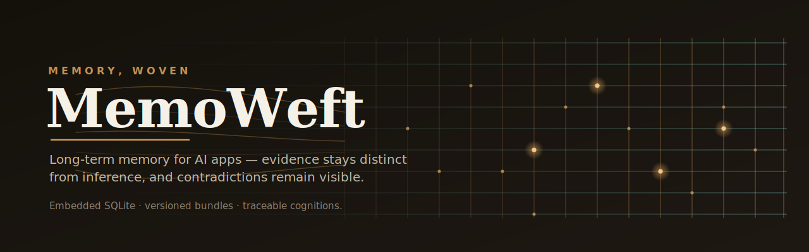
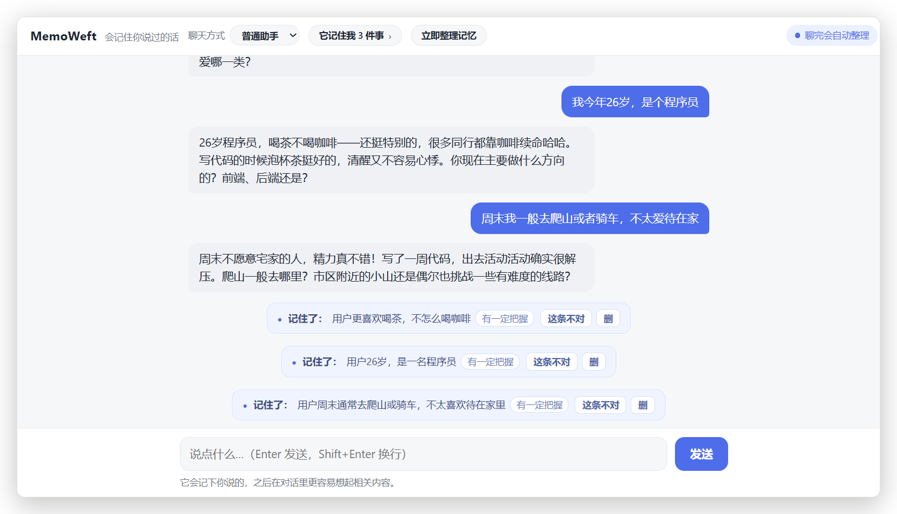
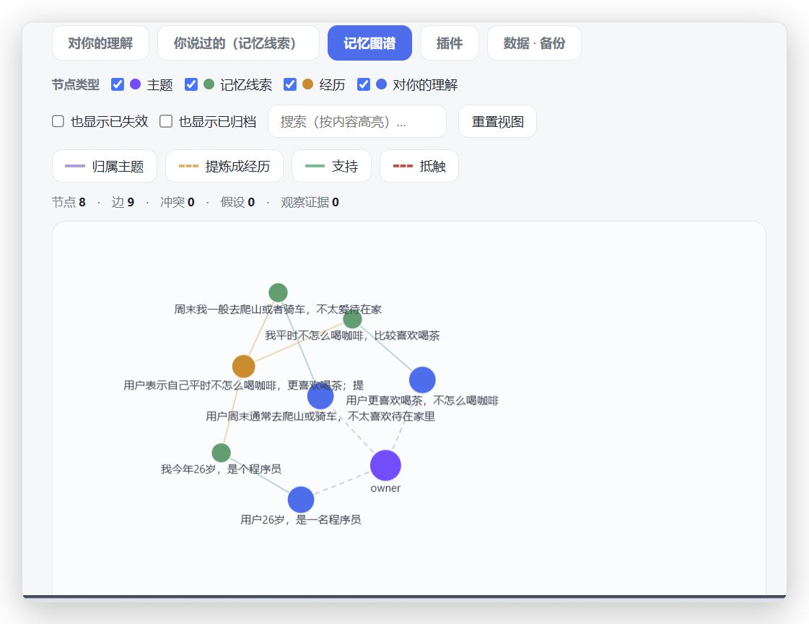
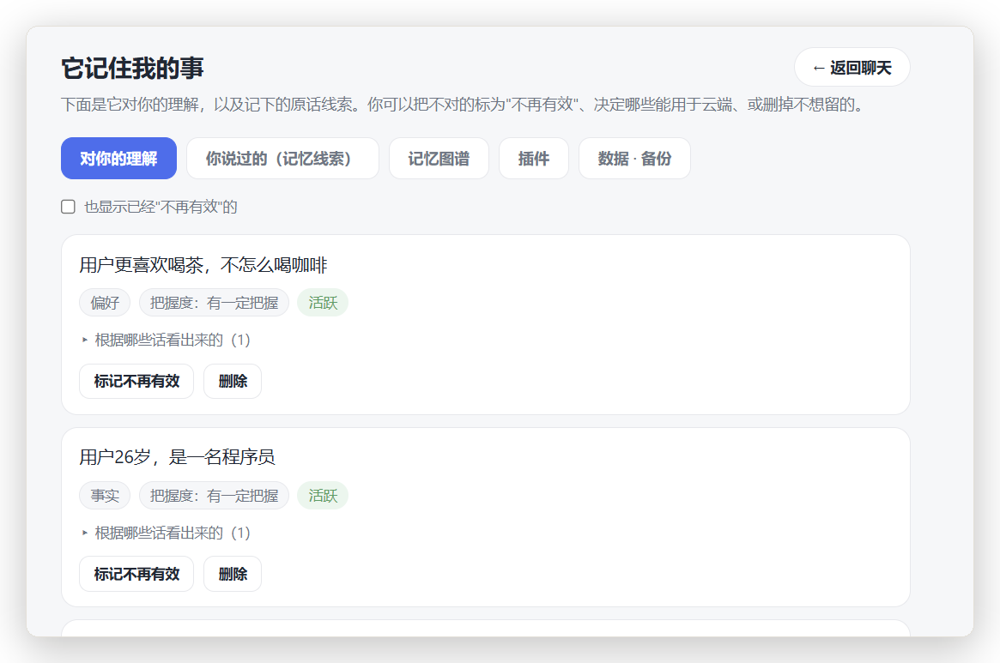

<div align="center">

<picture>
  <source media="(prefers-color-scheme: dark)" srcset="assets/hero-dark.svg">
  <source media="(prefers-color-scheme: light)" srcset="assets/hero-light.svg">
  
</picture>

# MemoWeft

**Long-term memory and user-cognition layer for AI apps.**

MemoWeft is a library that lets AI apps keep portable, traceable long-term memory about a user. It separates facts from guesses, exposes conflicts instead of silently overwriting them, and lets different hosts reuse the same memory.

[](https://www.npmjs.com/package/memoweft)
[](https://github.com/memoweft/memoweft/actions/workflows/ci.yml)
[](#project-status)
[](#project-status)
[](LICENSE)

[Run the demo](#run-the-demo) · [Why it is different](#why-it-is-different) · [Use as a library](#use-it-as-a-library) · [Reference host](#reference-host-demo) · [Docs](#documentation)

**English** · [简体中文](./README.zh-CN.md)

</div>

## Run the demo

The bundled reference host requires Node.js 24 or newer.

```bash
git clone https://github.com/memoweft/memoweft.git
cd memoweft
npm install
npm run build
npm start -w @memoweft/host
```

Open:

```text
http://localhost:7788
```

This starts the bundled **reference host demo**. It demonstrates MemoWeft Core in an app; it is not the product or the library itself. On first launch, point the setup screen at an OpenAI-compatible model endpoint.

## What it is

MemoWeft is a library you `import` into an AI application. It owns memory correctness and returns relevant, traceable user context when a host asks for it.

| Layer                                     | Responsibility                                                                          |
| ----------------------------------------- | --------------------------------------------------------------------------------------- |
| **Core** (`src/`, npm package `memoweft`) | Evidence, events, cognitions, confidence, conflicts, recall, and controlled memory APIs |
| **Host** (`apps/memoweft-host`)           | Chat, UI, persona, consent, and when or how memory is used                              |
| **Plugins** (`plugins/`)                  | Optional collectors and experience extensions, subject to host and Core boundaries      |

MemoWeft does not ship a chat product, persona, or UI. Those belong to the host.

## Why it exists

Changing models or hosts often resets everything an assistant learned about a user. Stuffing an ever-growing transcript into a prompt is expensive, hard to trace, and difficult to migrate.

MemoWeft treats the understanding of a user as a durable data asset: it can be accumulated over time, traced back to evidence, exported, and reused across models and hosts.

## Why it is different

- **Recorded does not mean believed.** Stored evidence and accepted cognition are different things.
- **Facts and guesses stay separate.** Model inferences begin as low-confidence hypotheses, not facts.
- **Conflicts are surfaced.** Contradictory information is exposed instead of silently overwritten.
- **Confidence is computed by MemoWeft.** The library uses evidence strength and corroboration instead of trusting a model's self-reported score.
- **Temporary states fade.** Short-lived moods decay while durable preferences persist.
- **Every cognition is traceable.** Judgments link back to the evidence that formed them.
- **The assistant cannot corroborate itself.** Its own output and user silence are not treated as evidence.

These rules are backed by numbered eval cases in [`tests/eval/cognition-discipline.eval.test.ts`](./tests/eval/cognition-discipline.eval.test.ts) and run with `npm test`.

## Use it as a library

Install the Core package:

```bash
npm install memoweft
```

Node.js 24 works with the built-in `node:sqlite` driver. On Node.js 20 or 22, also install the optional `better-sqlite3` peer dependency.

Configure any OpenAI-compatible endpoint:

```bash
MEMOWEFT_LLM_BASE_URL=https://your-endpoint/v1
MEMOWEFT_LLM_API_KEY=sk-...
MEMOWEFT_LLM_MODEL=gpt-4o-mini
```

Then create and use the Core through its public entry point:

```ts
import { createMemoWeftCore } from 'memoweft';

const core = createMemoWeftCore({ dbPath: './memoweft.db' });
const subjectId = 'user-42';

await core.ingestUserMessage({
  subjectId,
  content: 'I only drink decaf after 3pm because caffeine disrupts my sleep.',
});

await core.updateProfile({ subjectId });

const turn = await core.handleConversationTurn({
  subjectId,
  message: 'Recommend an afternoon drink.',
});

console.log(turn.reply);
console.log(turn.recall);

core.close();
```

A runnable version is in [`examples/minimal.ts`](./examples/minimal.ts). See the [examples index](./examples/README.md) and [integration guide](./docs/integration.md) for the rest of the public surface.

## Reference host demo

The bundled host is a reference implementation that shows how an application can use Core without reaching into its stores. It demonstrates chat with recall, visible memory formation, evidence and cognition inspection, memory management, portable bundles, and plugin or observation flows.

Read [what the reference host is and is not](./docs/reference-host.md).







## Ecosystem adapters

- [`@memoweft/mcp-server`](./packages/mcp-server) exposes guarded MemoWeft read and write tools over the Model Context Protocol.
- [`@memoweft/adapter-ai-sdk`](./packages/adapter-ai-sdk) adds recall and evidence capture to the Vercel AI SDK.

Both are thin adapters over the same Core rules; they do not change the Core package's zero-runtime-dependency baseline.

## Documentation

Start with the [public documentation index](./docs/README.md).

Key guides cover [integration](./docs/integration.md), [architecture](./docs/architecture.md), [deployment](./docs/deployment.md), the [public memory surface contract](./docs/memory-surface-contract.md), and the [plugin contract](./docs/plugin-contract.md).

## Repository layout

- `src/` — MemoWeft Core library.
- `apps/memoweft-host/` — bundled reference host demo.
- `packages/` — ecosystem adapters such as MCP and AI SDK.
- `plugins/` — optional collectors and experience plugins.
- `examples/` — small integration examples.
- `docs/` — public documentation.

## Project status

MemoWeft is pre-1.0 and library-first. Core behavior is implemented and tested, but interfaces may still change between minor releases. Stable, experimental, and internal surfaces are documented in the [Memory Surface Contract](./docs/memory-surface-contract.md).

Latest release: **0.5.0** — `npm install memoweft`.

See the [roadmap](./ROADMAP.md), [contribution guide](./CONTRIBUTING.md), and [changelog](./CHANGELOG.md).

## License

[MIT](./LICENSE) © 2026 MemoWeft contributors.
