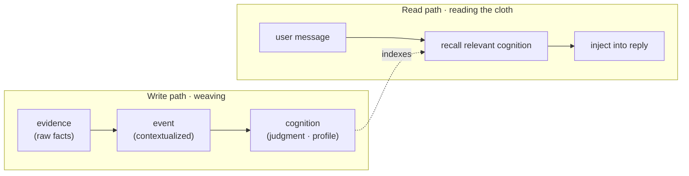

<div align="center">

# 🧵 MemoWeft

### Long-term memory for AI apps — it remembers who the user is, keeps facts and guesses apart, and carries that across models.

*Scattered memory cues, woven thread by thread into a picture of who the user is — without pretending every thread is equally trustworthy.*

[](https://www.npmjs.com/package/memoweft)

[](https://github.com/memoweft/memoweft/actions/workflows/ci.yml)


**English** | [简体中文](./README.zh-CN.md)

</div>

---

## Swap the model, and the AI forgets you entirely

You chat with an assistant for three months. It slowly learns your schedule, your taste, your quirks. Then you swap the underlying model — and it draws a blank, asking "who are you?" all over again.

Stuffing everything into the prompt isn't the answer either: you can't trace it (why does it believe that?), you can't carry it (the next model can't use it), and it just grows longer and pricier.

**MemoWeft treats the understanding of a person as a durable asset** — something you accumulate, trace, and move — instead of a throwaway prompt.

It's a library you `import`, not an app: **it doesn't chat, doesn't do personas, doesn't render UI** — that's the host's job. It does one thing: weave the memory, keep it, and hand it back when you ask.

---

## 🚀 Run it first (one command, watch it remember you)

Don't feel like reading docs? Just run it — two minutes to see for yourself:

```bash
git clone https://github.com/memoweft/memoweft.git
cd memoweft
npm install
npm run build
npm start -w @memoweft/host        # → http://localhost:7788
```

Open `http://localhost:7788` and chat a little. After a few messages — once it tidies things up in the background — **the "it remembers N things about me" button in the top bar ticks up**. That's the understanding it has quietly accumulated about you; click it to see exactly what it kept.

Then the fun part: from the top bar, flip the **plain assistant** into **星瑶 (Xingyao)**, a companion persona — **same memory, different face, memory intact**.

Memory is the substrate; the persona is just a face on top you can swap anytime — Xingyao is one that ships in the box, bring your own instead.

> Want to configure a model first? The first launch walks you through a quick setup — just point it at an OpenAI-compatible endpoint (cloud or local). Just want the library, a few lines into your own app? See the "🧩 Use it as a library" section below.

---

## Why it's not "just another vector memory store"

A plain memory store's logic is: stored = true, and newest wins. MemoWeft doesn't play that way — it's **fussy about what it's allowed to believe**. That "cognitive discipline" is the real difference:

- **Recorded ≠ believed.** What the user said and what the LLM guessed are not the same thing. Model inferences enter as **low-confidence candidates**, never as fact.
- **Conflicts are surfaced, not silently merged.** Said you love coffee last week, quit it this week? It won't quietly pick one — it flags the conflict and waits.
- **Confidence is computed, not self-reported.** How trustworthy a belief is comes from evidence strength and repeated corroboration, not the LLM grading itself.
- **Moods fade, preferences stick.** "Bad day today" decays over time; "I don't eat cilantro" isn't auto-forgotten.
- **No self-corroboration.** The assistant's own words and the user's silence are not evidence — otherwise it just talks itself into believing its own guesses.

| | Typical vector / memory store | MemoWeft |
| --- | --- | --- |
| Conflicting info | overwrite / keep latest | **conflict exposed**, not silently merged |
| Trust | stored = treated as true | **recorded ≠ believed** |
| Model guesses | may slip in as fact | **low-confidence hypothesis** |
| Expiry | permanent | **typed expiry** (moods fade, preferences stick) |

In a line: others "remember"; MemoWeft aims to **remember, and not misuse it**.

---

## ✨ What you get

- 🧠 **Cognitive discipline** — recorded ≠ believed, conflicts exposed, confidence self-computed, typed expiry (the set above).
- 🔀 **Swap models without losing memory** — the cognition layer is plain data in SQLite, not baked into weights. GPT, Claude, a local model — the memory stays.
- 🔎 **Every judgment is traceable** — why does it believe that? It traces back to the raw evidence that formed it.
- 🧩 **One memory, many faces** — experience plugins decide tone and persona (plain + 星瑶 ship in-box) over shared memory.
- ☁️ **Cloud-first, not cloud-blind** — model calls can go to the cloud, but each evidence item controls whether it may be cloud-read; desktop/behavior observations default to local-only.
- 👀 **It can sense, not just chat** — beyond conversation, it ingests behavior observations (e.g. an active-window collector plugin) as evidence.
- 🪶 **Zero runtime dependencies** — storage / HTTP / vectors all use Node built-ins (`node:sqlite` / `node:http` / `node:fs`), not a single third-party package. `npm install memoweft` drags in nothing. On **Node ≥ 24** this works out of the box (`node:sqlite` stabilized there). On **Node 20 / 22** the built-in isn't available, so add the optional `better-sqlite3` driver (`npm i better-sqlite3`) — it's an optional peer dependency, not part of the zero-dep baseline.

---

## 🧵 Three memory layers, how it's woven



| Layer | Plain meaning |
| --- | --- |
| **evidence** | The source of truth: what the user said or what was observed. Facts only, no judgments. |
| **event** | Evidence in context: a small summary of what happened. |
| **cognition** | The judgment layer: a user-profile entry with confidence and source links. |

Reads and writes are **decoupled**: reads are light and synchronous; writes are batched and asynchronous — so tidying memory never blocks a reply.

---

## 🧩 Use it as a library (copy-paste and run)

**① Install** (Node ≥ 24 works out of the box; on Node 20/22 also run `npm i better-sqlite3`):

```bash
npm install memoweft
```

**② Configure a chat model** — create `.env` in your project root with any OpenAI-compatible endpoint:

```bash
MEMOWEFT_LLM_BASE_URL=https://your-endpoint/v1
MEMOWEFT_LLM_API_KEY=sk-...
MEMOWEFT_LLM_MODEL=gpt-4o-mini
```

**③ Save as `demo.mjs`, run `node --env-file=.env demo.mjs`** — the unified entry `createMemoWeftCore` wires the three stores, retriever, and model pool in one call (all read from `.env`, degrading gracefully when unconfigured):

```ts
import { createMemoWeftCore } from 'memoweft';

// One call assembles the three stores + retriever + model pool from .env.
const core = createMemoWeftCore({ dbPath: './memoweft.db' });

const subjectId = 'user-42';

// 1) Feed the user's own words as evidence.
await core.ingestUserMessage({
  subjectId,
  content: 'I only drink decaf after 3pm — caffeine wrecks my sleep.',
});

// 2) Tidy raw evidence into a confidence-scored profile (batched write path).
await core.updateProfile({ subjectId });

// 3) Reply with relevant user context recalled and injected.
const turn = await core.handleConversationTurn({
  subjectId,
  message: 'Recommend me an afternoon drink',
});
console.log(turn.reply);   // the reply carries "no caffeine in the afternoon for you"
console.log(turn.recall);  // which understandings got recalled and injected this turn

core.close();
```

> TypeScript projects just need the usual `@types/node`. On Node 20/22, also install the optional `better-sqlite3` driver (`npm i better-sqlite3`). No embedder configured? Recall falls back to empty automatically — writes still land as evidence, replies just skip semantic recall. A runnable in-repo version is in [`examples/minimal.ts`](./examples/minimal.ts); for direct access to the underlying parts (`openStores` / `Conversation` / `updateProfile` / retrievers), see [`docs/integration.md`](./docs/integration.md).

---

## ☁️ Model deployment: cloud-first, not cloud-blind

The default is **cloud-friendly**: point it at an OpenAI-compatible cloud endpoint and it runs — no local models required up front. But that doesn't mean every raw evidence item is safe to send to the cloud. The boundary:

- **Model calls may be cloud-first.** Chat, write-path, attribution, trends, and embeddings can all use OpenAI-compatible cloud endpoints.
- **Evidence controls cloud access.** Each evidence item carries authorization bits like `allowCloudRead`.
- **Observed behavior defaults conservative.** Desktop, screen, clipboard, file, health/sleep observations default to **not cloud-readable** unless the host explicitly asks.
- **Consent belongs to the host.** MemoWeft provides the model switches and filtering hooks; policy and consent UI are the host's.

| Mode | Best for | Summary |
| --- | --- | --- |
| **Cloud-first** | demos, prototypes, normal onboarding | chat / write / embed all go to the cloud, fastest to run |
| **Cloud-guarded** | real apps using cloud models | cloud models are used, but `allowCloudRead=false` evidence is filtered out |
| **Hybrid / local-sensitive** | privacy-sensitive desktop assistants | sensitive observations stay local, lower-risk calls may use cloud |

Full policy in [`docs/deployment.md`](./docs/deployment.md).

---

## ⚙️ Configuration

Models are read from environment variables. Prefer the `MEMOWEFT_*` prefix; the legacy `DLA_*` prefix still works.

| Purpose | Variables |
| --- | --- |
| Chat LLM | `MEMOWEFT_LLM_BASE_URL` · `MEMOWEFT_LLM_API_KEY` · `MEMOWEFT_LLM_MODEL` |
| Write LLM | `MEMOWEFT_WRITE_LLM_BASE_URL` · `MEMOWEFT_WRITE_LLM_API_KEY` · `MEMOWEFT_WRITE_LLM_MODEL` |
| Embedder | `MEMOWEFT_EMBED_BASE_URL` · `MEMOWEFT_EMBED_API_KEY` · `MEMOWEFT_EMBED_MODEL` |

All three accept OpenAI-compatible endpoints. Cloud is the easiest default; local endpoints like Ollama or LM Studio work too. Full env reference in [`docs/INSTALL.md`](./docs/INSTALL.md).

---

## 🔌 What it does / doesn't do

| MemoWeft (the library) | The host app |
| --- | --- |
| Ingests evidence, weaves the three layers, computes confidence, hands back traceable context | Chat, persona, tone, UI, when to speak |
| Keeps model routing swappable, records evidence-level authorization | Privacy policy, consent UI, what's stored at all |
| Returns relevant user context on request | Decides how to use it (reply / tool call / desktop assistant / agent) |

Main exports are in [`src/index.ts`](./src/index.ts); integration guide in [`docs/integration.md`](./docs/integration.md).

---

## 📦 Project status

**Early alpha.** The Core, a reference host, and the first two plugins are in place and tested; the algorithms and cognitive discipline are real. Interfaces may still move.

**Working now**

- **Cognitive core** — evidence → event → cognition, profile + recall, correction loop, attribution + proactive asking, periodic background (decay, typed expiry, recall gating, conflict revisit, trends).
- **Unified entry** — `createMemoWeftCore` + a controlled memory-management API (invalidate / authorize / safe-delete / merge / archive / integrity check) so hosts never touch the stores directly.
- **Portability & graph** — portable memory bundle (import / export / validate, faithful + idempotent) + memory-graph backend payload.
- **Cloud Guard** — cloud-read filtering on the write / trends / attribution paths.
- **Reference host** (`apps/memoweft-host`) — chat, setup wizard, memory-management page, multi-session, backup / restore, factory reset — all through the Core public API.
- **Experience plugin contract v1** — swappable personas over one core (plain + 星瑶).
- **Collector plugin** — active-window collector in its own package (`@memoweft/collector-active-window`), feeding the host via `/api/observe`.
- **Published to npm** — `npm install memoweft` (first release `0.1.0`).
- **Schema versioning & migrations** — `PRAGMA user_version` + a migration runner (transactional, auto-backup, dry-run); a `0.1.0` database opens losslessly. On `main`, ships in `0.2.0`.

**Not yet**

- Memory-graph front-end (the backend payload is ready).
- Recall-refinement follow-ups (e.g. similarity-threshold gating).

Where it's headed — and why the library (not the host) is the product — is in [`ROADMAP.md`](./ROADMAP.md); the current working focus is in [`CURRENT.md`](./CURRENT.md).

> **Open source, permanently.** The core library is and will remain fully open source under MIT — no hidden enterprise edition, no open-core split. If a hosted service ever exists, it will only sell convenience, never withheld features.

---

## 📚 Documentation

| Doc | What's inside |
| --- | --- |
| [`docs/INSTALL.md`](./docs/INSTALL.md) | Install, configure `.env`, run tests, launch the host / testbench |
| [`docs/deployment.md`](./docs/deployment.md) | Cloud-first / cloud-guarded / hybrid deployment and privacy modes |
| [`docs/architecture.md`](./docs/architecture.md) | Three layers, read/write decoupling, swappable parts, cognitive-discipline details |
| [`docs/integration.md`](./docs/integration.md) | Host integration guide + export table |
| [`docs/naming.md`](./docs/naming.md) | Bilingual naming & positioning guide |
| [`plugins/collector-active-window/README.md`](./plugins/collector-active-window/README.md) | Active-window collector plugin (collector → host → core flow) |
| [`docs/PUBLISHING.md`](./docs/PUBLISHING.md) | Packaging & npm release flow |
| [`examples/minimal.ts`](./examples/minimal.ts) | Runnable minimal example |

Internal design notes and archived dev whiteboards (project map, `STATE`) live in [`docs/internal/`](./docs/internal/) — historical background on how the project was built, not required to use the library or to contribute.

---

## 🤝 Contributing

Any code change must keep three checks green:

```bash
npm run typecheck && npm test && npm run build
```

New here, AI or human? Start with [`AGENTS.md`](./AGENTS.md) and [`CURRENT.md`](./CURRENT.md); the hard rules are in [`CONTRIBUTING.md`](./CONTRIBUTING.md).

## License

[MIT](./LICENSE) © 2026 MemoWeft contributors.

## Acknowledgements

Independently built, drawing on ideas from **Mem0** and **Graphiti** — interfaces are kept isolated so parts stay swappable.
