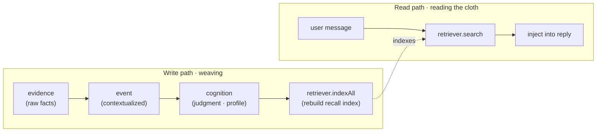

<div align="center">

# 🧵 MemoWeft

**A user-cognition layer for LLM apps — it remembers what the user said, tracks which parts are solid vs. just a guess, and carries that context across models.**

*Scattered memory cues are woven, thread by thread, into a picture of who the user is — without pretending every thread is equally trustworthy.*


[](https://github.com/kestercarroll702-gif/memoweft/actions/workflows/ci.yml)


**English** | [简体中文](./README.zh-CN.md)

</div>

---

> ⚠️ **Experimental · early alpha.** The core works and is tested (**all tests green in CI**), but interfaces may still change — not production-ready yet.

## 🧭 What it is

MemoWeft is a **user-cognition layer** — the part that remembers the *user*, sitting outside your LLM app. It does not claim to truly understand people; it is disciplined about what it is allowed to believe.

In plain terms, it:

- **Remembers what the user said** — their own words become durable memory cues, not a prompt that vanishes.
- **Marks guesses as guesses** — a hunch inferred by an LLM is low-confidence, never treated as fact.
- **Exposes contradictions** — when two signals disagree, it surfaces the conflict instead of silently picking one.
- **Lets passing states fade** — moods and short-lived states decay faster than stable preferences.
- **Carries user context across models and roles** — different assistants can inherit one shared picture of the user.

Under the hood, MemoWeft receives user-authorized conversation and behavior evidence, distills it into events, and consolidates it into confidence-scored cognition entries. The resulting profile is **model-independent, traceable, evolvable, and portable**.

It is a **library you `import`**, not an app:

- ❌ It does **not** chat, roleplay, or render UI.
- ❌ It does **not** decide your assistant's tone or persona.
- ❌ It does **not** own your privacy or security policy — the host does.
- ✅ It **does** turn `evidence → event → cognition` into a source-traceable user profile, and gives relevant context back on request.

> **Minimal mental model for integrators:** hand the user's message or observation to MemoWeft as evidence, then ask MemoWeft for relevant context when your app replies. Everything else — events, confidence, attribution, decay, conflict review — is how the library keeps that memory disciplined under the hood.

---

## 🔤 Naming · product words ↔ engineering words

| Product word | Engineering word |
| --- | --- |
| memory cues | `evidence` |
| moments / episodes | `event` |
| understanding entries | `cognition` |
| what it understands about the user | `profile` |
| confidence | `confidence` |
| tentative guess | `hypothesis` |
| recalling relevant context | `recall` |
| guessing why | `attribution` / `attribute` |
| contradictions to confirm | `conflict` |
| tidy up memory | `updateProfile` |
| questions it wants to ask | `asking` / `proposeAsk` |
| check contradictions | `revisitConflicts` |
| summarize recent state | `aggregateTrends` |
| distill into moments | `distill` |
| consolidate understanding | `consolidate` |

Full bilingual naming & positioning guide: [`docs/naming.md`](docs/naming.md).

---

## Why MemoWeft

Swap the model and the memory is gone. Stuff context into a prompt and it is neither traceable nor portable — you cannot tell *why* the assistant believes something, and you cannot carry that understanding to the next model.

MemoWeft treats the understanding of a user as a **first-class durable asset** rather than a throwaway prompt:

- **Cross-model portable** — the cognitive layer is plain data in SQLite, not baked into a model's weights.
- **Traceable** — every judgment links back to the raw evidence that formed it.
- **Woven, not dumped** — fragments are consolidated into a multi-dimensional user profile instead of appended to an ever-growing prompt.

It is **not just another vector-memory store**. The difference is **cognitive discipline** — rules that decide what MemoWeft is allowed to believe.

---

## 📐 Cognitive discipline

Five rules govern what gets believed:

- **Recorded ≠ believed.** LLM inferences enter as low-confidence candidates, never as fact.
- **No system self-corroboration.** The assistant's own output and the user's silence are not evidence.
- **Conflicts are exposed, not auto-resolved.** Contradictory signals are flagged instead of silently merged.
- **Confidence is computed by MemoWeft, not self-reported by the LLM.**
- **Typed expiry.** Fleeting states fade fast; explicit preferences persist.

| | Typical vector / memory store | MemoWeft |
| --- | --- | --- |
| Conflicting info | overwrite / keep latest | **conflict exposed**, not silently merged |
| Trust | stored = treated as true | **recorded ≠ believed** |
| Model guesses | may slip in as fact | **low-confidence hypothesis** |
| Expiry | permanent | **typed expiry** |

---

## 🧵 Core concept: three layers



| Layer | Plain meaning |
| --- | --- |
| **evidence** | The source of truth: what the user said or what was observed. No judgments live here. |
| **event** | Evidence placed in context: a small summary of what happened. |
| **cognition** | The judgment layer: a user-profile entry with confidence and source links. |

Reads are light and synchronous; writes are batched and asynchronous, so profile updates do not block replies.

---

## ⚡ Quick start

> **Requirements:** Node ≥ 24, TypeScript. MemoWeft has **zero runtime dependencies** and uses Node built-ins such as `node:sqlite`, `node:http`, and `node:fs`.

MemoWeft is currently **used from source** and is not published to npm yet.

```bash
git clone https://github.com/kestercarroll702-gif/memoweft.git
cd memoweft
npm install
npm run typecheck && npm test && npm run build
```

Until it is published to npm, imports shown as `from 'memoweft'` should be resolved through a local path, local `npm install <path>`, git submodule, or the built `dist/index.js`. See [`docs/INSTALL.md`](docs/INSTALL.md).

Configure a model and, optionally, an embedder in `.env`. Then wire the three stores, write evidence, update the profile, and recall it in a reply:

```ts
import {
  openStores,
  VectorRetriever,
  NullRetriever,
  OpenAICompatEmbedder,
  loadEmbedConfig,
  loadLLMPool,
  updateProfile,
  Conversation,
  type Retriever,
} from 'memoweft';

const { evidenceStore, eventStore, cognitionStore, transaction } = openStores('./memoweft.db');

const pool = loadLLMPool();
const embedConfig = loadEmbedConfig();
const retriever: Retriever = embedConfig
  ? new VectorRetriever('./memoweft-vectors.db', new OpenAICompatEmbedder(embedConfig))
  : new NullRetriever();

const subjectId = 'user-42';

evidenceStore.put({
  subjectId,
  sourceKind: 'spoken',
  hostId: 'my-app',
  rawContent: 'I only drink decaf after 3pm — caffeine wrecks my sleep.',
});

await updateProfile(subjectId, {
  evidenceStore,
  eventStore,
  cognitionStore,
  retriever,
  transaction,
  llm: pool.for('write'),
});

const convo = new Conversation({
  store: evidenceStore,
  retriever,
  cognitionStore,
  llm: pool.for('chat'),
});

const turn = await convo.handle('Recommend me an afternoon drink', { subjectId });
console.log(turn.reply);
console.log(turn.recall);
```

No embedder configured yet? Use `NullRetriever` or omit semantic recall while testing — writes still land as evidence.

---

## ☁️ Model deployment: cloud-first, not cloud-blind

MemoWeft is **cloud-friendly by default**: new developers should be able to provide OpenAI-compatible cloud endpoints and see the testbench work without first installing local models.

At the same time, MemoWeft should never imply that all raw evidence is safe to send to the cloud. The boundary is:

- **Model calls may be cloud-first.** Chat, write-path, attribution, trends, and embeddings can all use OpenAI-compatible cloud endpoints.
- **Evidence controls cloud access.** Each evidence item can carry authorization bits such as `allowCloudRead`.
- **Observed behavior should be conservative.** Desktop, device, screen, clipboard, file, health, and wearable observations should default to not cloud-readable unless the host explicitly asks the user.
- **The host owns consent.** MemoWeft provides the model switches and filtering hooks; the host owns policy, UI, and user-facing consent.

Recommended modes:

| Mode | Best for | Summary |
| --- | --- | --- |
| **Cloud-first** | demos, prototypes, normal developer onboarding | chat/write/embed all point to cloud endpoints |
| **Cloud-guarded** | real apps using cloud models | cloud models are used, but non-cloud-readable evidence is filtered |
| **Hybrid / local-sensitive** | privacy-sensitive desktop assistants | sensitive observations stay local while lower-risk calls may use cloud |

See [`docs/deployment.md`](./docs/deployment.md) for the full policy and examples.

---

## 🖥️ Experience layer: optional local web UI

MemoWeft ships an optional local testbench / experience UI so you can feel the system before wiring it into a host app.

```bash
cp .env.example .env
npm run experience
# → http://localhost:7888
```

Three modes are available:

- **Setup wizard** — fill in model / embedder keys and generate `.env`.
- **User-experience mode** — chat and watch it build a plain-language picture of what it understands.
- **Developer mode** — inspect evidence, events, cognition, recall, configuration knobs, attribution, asking, and background profile updates.

The UI is optional and not a core dependency. MemoWeft remains a library you `import`.

---

## Configuration

MemoWeft reads models from environment variables. Prefer the `MEMOWEFT_*` prefix; the legacy `DLA_*` prefix still works.

| Purpose | Variables |
| --- | --- |
| Chat LLM | `MEMOWEFT_LLM_BASE_URL` · `MEMOWEFT_LLM_API_KEY` · `MEMOWEFT_LLM_MODEL` |
| Write LLM | `MEMOWEFT_WRITE_LLM_BASE_URL` · `MEMOWEFT_WRITE_LLM_API_KEY` · `MEMOWEFT_WRITE_LLM_MODEL` |
| Embedder | `MEMOWEFT_EMBED_BASE_URL` · `MEMOWEFT_EMBED_API_KEY` · `MEMOWEFT_EMBED_MODEL` |

All three groups accept OpenAI-compatible endpoints. Cloud endpoints are the easiest default; local endpoints such as Ollama or LM Studio remain supported.

See [`docs/INSTALL.md`](./docs/INSTALL.md) for the full env reference.

---

## 🔌 What it does / doesn't do

| MemoWeft | The host app |
| --- | --- |
| Ingests evidence, weaves the three layers, computes confidence, exposes traceable user context | Owns chat, persona, tone, UI, and when to speak |
| Keeps model routing swappable and records evidence-level authorization | Owns privacy policy, consent UI, and what is stored at all |
| Hands back relevant user context on request | Decides how to use it in a reply, tool call, desktop assistant, or agent |

Main exports are listed in [`src/index.ts`](./src/index.ts) and explained in [`docs/integration.md`](./docs/integration.md).

---

## Project status

**Alpha / early.** The first core skeleton is in place and green; the algorithms and cognitive discipline are real and tested. Interfaces may still move.

**Done**

- Phases 0–4B: evidence layer, profile + recall, correction loop, attribution + proactive asking, periodic background (decay, typed expiry, recall gating, conflict revisit, trends).
- Phase 4-A tier 1: behavior-observation intake (`ingestObservations` + active-window → `observed` evidence).
- Batched profile updates + configurable independent write-path model.
- Phase 5-A: portable memory bundle (`exportBundle` / `validateBundle` / `importBundle`, faithful + idempotent + migratable).
- Phase 5-B: testbench import/export (`/api/export-bundle`, `/api/import-bundle?mode=dryRun|merge`) + backup/migration panel.
- Phase 6-A: memory-management page (filter, detail, edit/delete, invalidate, authorization toggles).
- Phase 6-B G1: memory-graph backend (`buildMemoryGraph` payload).
- Phase 7-A: Cloud Guard (cloud-read filtering added on the trends/ask paths).
- Phase 8-A (= 4-A tier 2): real active-window collector (Win32 foreground-window sampling loop + `npm run collector` runner).
- Verified end-to-end against a cloud model, dogfooded, and all tests green in CI.

**Not yet**

- Phase 6-B G2: memory-graph front-end (the backend payload is ready).
- Phase 9-A: minimal Xingyao (星瑶) host — the first real host app.
- Phase 10-A: plugin contract.
- Phase 11-A: stability / migration hardening.
- Phase 12-A: npm publishing.
- Recall-refinement follow-ups (e.g. similarity-threshold gating).

Status is derived from [`STATE.md`](./STATE.md).

---

## Documentation

| Doc | What's inside |
| --- | --- |
| [`docs/INSTALL.md`](./docs/INSTALL.md) | Install, configure `.env`, run tests, launch the testbench |
| [`docs/deployment.md`](./docs/deployment.md) | Cloud-first / cloud-guarded / hybrid model deployment and privacy modes |
| [`docs/architecture.md`](./docs/architecture.md) | Three layers, read/write decoupling, swappable parts, cognitive-discipline details |
| [`docs/integration.md`](./docs/integration.md) | Host integration guide + export table |
| [`docs/MAINTENANCE.md`](./docs/MAINTENANCE.md) | AI-maintenance strategy |
| [`docs/PUBLISHING.md`](./docs/PUBLISHING.md) | Packaging & npm release flow |
| [`examples/minimal.ts`](./examples/minimal.ts) | Runnable minimal example |
| [`AGENTS.md`](./AGENTS.md) · [`CONTRIBUTING.md`](./CONTRIBUTING.md) | AI-maintainer working contract & contribution guardrails |

---

## Contributing

MemoWeft is documented to be **AI-maintainable**: layered docs (`STATE.md`, `docs/项目地图.md`, `LOG.md`) plus a working contract in [`AGENTS.md`](./AGENTS.md). Any code change must keep three checks green:

```bash
npm run typecheck && npm test && npm run build
```

See [`CONTRIBUTING.md`](./CONTRIBUTING.md).

## License

[MIT](./LICENSE) © 2026 MemoWeft contributors.

## Acknowledgements

Independently built, drawing on ideas from **Mem0** and **Graphiti** — interfaces are kept isolated so parts stay swappable.
