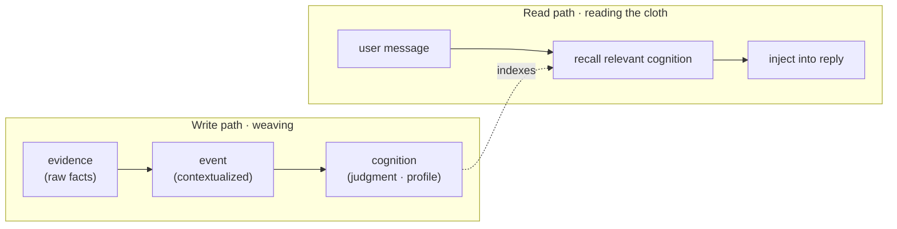

<div align="center">

<picture>
  <source media="(prefers-color-scheme: dark)" srcset="assets/hero-dark.svg">
  <source media="(prefers-color-scheme: light)" srcset="assets/hero-light.svg">
  
</picture>

# MemoWeft

**Long-term memory for AI apps — it remembers who the user is, keeps facts and guesses apart, and carries that across models.**

*Scattered memory cues, woven thread by thread into a picture of who the user is — without pretending every thread is equally trustworthy.*

[](https://www.npmjs.com/package/memoweft)
[](https://github.com/memoweft/memoweft/actions/workflows/ci.yml)
[](#project-status)
[](#what-you-get)
[](#use-it-as-a-library)
[](LICENSE)

[Run it](#run-it-in-one-command) · [Why it's different](#why-its-not-just-another-vector-memory-store) · [Use as a library](#use-it-as-a-library) · [See the host](#a-look-at-the-reference-host) · [Docs](#documentation)

English · [简体中文](./README.zh-CN.md)

</div>

---

## Swap the model, and the AI forgets you entirely

You chat with an assistant for three months. It slowly learns your schedule, your taste, your quirks. Then you swap the underlying model — and it draws a blank, asking "who are you?" all over again.

Stuffing everything into the prompt isn't the answer either: you can't trace it (why does it believe that?), you can't carry it (the next model can't use it), and it just grows longer and pricier.

**MemoWeft treats the understanding of a person as a durable asset** — something you accumulate, trace, and move — instead of a throwaway prompt.

It's a library you `import`, not an app: **it doesn't chat, doesn't do personas, doesn't render UI** — that's the host's job. It does one thing: weave the memory, keep it, and hand it back when you ask.

---

## Run it in one command

Don't feel like reading docs? Just run it — two minutes to see for yourself:

```bash
git clone https://github.com/memoweft/memoweft.git
cd memoweft
npm install
npm run build
npm start -w @memoweft/host        # → http://localhost:7788
```

Open `http://localhost:7788` and chat a little. After a few messages — once it tidies things up in the background — **the "it remembers N things about me" button in the top bar ticks up**. That's the understanding it has quietly accumulated about you; click it to see exactly what it kept.

Then the fun part: from the top bar, flip the **plain assistant** into **星瑶 (Xingyao)**, a companion persona — **same memory underneath, a new face on top**.

Memory is the substrate; the persona is just a face you can swap anytime — Xingyao ships in the box, but you can bring your own.

> Want to configure a model first? The first launch walks you through a quick setup — just point it at an OpenAI-compatible endpoint (cloud or local). Only need the library, a few lines into your own app? See [Use it as a library](#use-it-as-a-library) below.

---

## A look at the reference host

The library ships no UI of its own — but the bundled reference host (`@memoweft/host`) shows what a memory-first app feels like. Every screen below runs entirely through the Core public API; nothing reaches into the stores directly. The reference host's UI is in Chinese; the captions below say what each shot shows.

**Chat that visibly remembers.** As you talk, MemoWeft weaves inline "remembered: …" notes into the stream and the top-bar counter ("it remembers N things about me") ticks up — memory forming as you speak, and staying under the user's control.


**A memory graph, not a flat log.** A hand-rolled canvas force-directed graph of subjects, evidence, events and cognitions — typed colored edges (supports / contradicts), pan / zoom / drag, a per-node detail panel, and zero dependencies.


**What it remembers, and why.** Every understanding is a card with a plain-language confidence band and an expandable trace back to the exact words it came from — plus controls to invalidate it or safely delete it.


**Cloud-first, yet private.** Each raw clue shows its source — spoken, observed, or inferred — and carries a per-item toggle for whether cloud models may read it; observed data defaults to local-only.


**Your memory is yours.** Export the whole memory bundle to a local file (keys and chat excluded), merge one back with a dry-run preview, or wipe everything behind a type-to-confirm reset.


---

## Why it's not "just another vector memory store"

A plain memory store's logic is: stored = true, and newest wins. MemoWeft doesn't play that way — it's **fussy about what it's allowed to believe**. That "cognitive discipline" is the real difference:

- **Recorded ≠ believed.** What the user said and what the LLM guessed are not the same thing. Model inferences enter as **low-confidence candidates**, never as fact.
- **Conflicts are surfaced, not silently merged.** Said you love coffee last week, quit it this week? It won't quietly pick one — it flags the conflict and waits.
- **Confidence is computed, not self-reported.** How trustworthy a belief is comes from evidence strength and repeated corroboration, not the LLM grading itself.
- **Moods fade, preferences stick.** "Bad day today" decays over time; "I don't eat cilantro" isn't auto-forgotten.
- **No self-corroboration.** The assistant's own words and the user's silence are not evidence — otherwise it just talks itself into believing its own guesses.

| | Typical vector / memory store | MemoWeft | Eval backing |
| --- | --- | --- | --- |
| Conflicting info | overwrite / keep latest | **conflict exposed**, not silently merged | `EVAL-C01`–`C07` |
| Trust | stored = treated as true | **recorded ≠ believed** | `EVAL-T01`, `T02` |
| Model guesses | may slip in as fact | **low-confidence hypothesis** | `EVAL-T03`–`T05` |
| Expiry | permanent | **typed expiry** (moods fade, preferences stick) | `EVAL-M01`–`M07` |

*Every row above is backed by numbered eval cases* — the assertions live in
[`tests/eval/cognition-discipline.eval.test.ts`](./tests/eval/cognition-discipline.eval.test.ts)
and run inside `npm test`, so these aren't claims, they're checks.

In a line: others "remember"; MemoWeft aims to **remember, and not misuse it**.

---

## What you get

- **Cognitive discipline** — recorded ≠ believed, conflicts exposed, confidence self-computed, typed expiry (the set above).
- **Swap models without losing memory** — the cognition layer is plain data in SQLite, not baked into weights. GPT, Claude, a local model — the memory stays.
- **Every judgment is traceable** — why does it believe that? It traces back to the raw evidence that formed it.
- **One memory, many faces** — experience plugins decide tone and persona (plain + 星瑶 ship in-box) over shared memory.
- **Cloud-first, not cloud-blind** — model calls can go to the cloud, but each evidence item controls whether it may be cloud-read; desktop/behavior observations default to local-only.
- **It can sense, not just chat** — beyond conversation, it ingests behavior observations (e.g. an active-window collector plugin) as evidence.
- **Zero runtime dependencies** — storage / HTTP / vectors all use Node built-ins (`node:sqlite` / `node:http` / `node:fs`), not a single third-party package. `npm install memoweft` drags in nothing. On **Node ≥ 24** this works out of the box (`node:sqlite` stabilized there). On **Node 20 / 22** the built-in isn't available, so add the optional `better-sqlite3` driver (`npm i better-sqlite3`) — an optional peer dependency, not part of the zero-dep baseline.

---

## Three memory layers, how it's woven



| Layer | Plain meaning |
| --- | --- |
| **evidence** | The source of truth: what the user said or what was observed. Facts only, no judgments. |
| **event** | Evidence in context: a small summary of what happened. |
| **cognition** | The judgment layer: a user-profile entry with confidence and source links. |

Reads and writes are **decoupled**: reads are light and synchronous; writes are batched and asynchronous — so tidying memory never blocks a reply.

---

## Use it as a library

**1. Install** (Node ≥ 24 works out of the box; on Node 20/22 also run `npm i better-sqlite3`):

```bash
npm install memoweft
```

**2. Configure a chat model** — create `.env` in your project root with any OpenAI-compatible endpoint:

```bash
MEMOWEFT_LLM_BASE_URL=https://your-endpoint/v1
MEMOWEFT_LLM_API_KEY=sk-...
MEMOWEFT_LLM_MODEL=gpt-4o-mini
```

**3. Save as `demo.mjs`, run `node --env-file=.env demo.mjs`** — the unified entry `createMemoWeftCore` wires the three stores, retriever, and model pool in one call (all read from `.env`, degrading gracefully when unconfigured):

```ts
import { createMemoWeftCore } from 'memoweft';

// One call assembles the three stores + retriever + model pool from .env.
const core = createMemoWeftCore({ dbPath: './memoweft.db' });

const subjectId = 'user-42';

// 1) Feed the user's own words as evidence.
await core.ingestUserMessage({
  subjectId,
  content: 'I only drink decaf after 3pm — caffeine wrecks my sleep.',
});

// 2) Tidy raw evidence into a confidence-scored profile (batched write path).
await core.updateProfile({ subjectId });

// 3) Reply with relevant user context recalled and injected.
const turn = await core.handleConversationTurn({
  subjectId,
  message: 'Recommend me an afternoon drink',
});
console.log(turn.reply);   // the reply carries "no caffeine in the afternoon for you"
console.log(turn.recall);  // which understandings got recalled and injected this turn

core.close();
```

> TypeScript projects just need the usual `@types/node`. On Node 20/22, also install the optional `better-sqlite3` driver (`npm i better-sqlite3`). No embedder configured? Recall falls back to empty automatically — writes still land as evidence, replies just skip semantic recall. A runnable in-repo version is in [`examples/minimal.ts`](./examples/minimal.ts); for direct access to the underlying parts (`openStores` / `Conversation` / `updateProfile` / retrievers), see [`docs/integration.md`](./docs/integration.md).

---

## The ecosystem: drop-in for MCP and the Vercel AI SDK

The core is `import`-and-go, but you don't have to wire the plumbing yourself. Two thin, separately-published adapters put MemoWeft behind interfaces you may already use:

| Package | What it gives you |
| --- | --- |
| [`@memoweft/mcp-server`](./packages/mcp-server) | A Model Context Protocol server exposing MemoWeft over **6 tools** (5 read + 1 guarded write), so any MCP-aware client — Claude Desktop, IDEs, agents — can recall and record memory. |
| [`@memoweft/adapter-ai-sdk`](./packages/adapter-ai-sdk) | Middleware for the **Vercel AI SDK** (`ai` v7): recall is injected before the model call, and new evidence is persisted when the stream ends — memory in a few lines, no bespoke glue. Requires Node ≥ 22. |

Both build on the same core and honor the same cognitive discipline and Cloud Guard rules. The core package itself stays at **zero runtime dependencies**.

---

## Model deployment: cloud-first, not cloud-blind

The default is **cloud-friendly**: point it at an OpenAI-compatible cloud endpoint and it runs — no local models required up front. But that doesn't mean every raw evidence item is safe to send to the cloud. The boundary:

- **Model calls may be cloud-first.** Chat, write-path, attribution, trends, and embeddings can all use OpenAI-compatible cloud endpoints.
- **Evidence controls cloud access.** Each evidence item carries authorization bits like `allowCloudRead`.
- **Observed behavior defaults conservative.** Desktop, screen, clipboard, file, health/sleep observations default to **not cloud-readable** unless the host explicitly asks.
- **Consent belongs to the host.** MemoWeft provides the model switches and filtering hooks; policy and consent UI are the host's.

| Mode | Best for | Summary |
| --- | --- | --- |
| **Cloud-first** | demos, prototypes, normal onboarding | chat / write / embed all go to the cloud, fastest to run |
| **Cloud-guarded** | real apps using cloud models | cloud models are used, but `allowCloudRead=false` evidence is filtered out |
| **Hybrid / local-sensitive** | privacy-sensitive desktop assistants | sensitive observations stay local, and the write path can run on a **local model tier** (`MEMOWEFT_WRITE_LLM_TIER=local`) so observed evidence is digested without leaving the machine |

Full policy in [`docs/deployment.md`](./docs/deployment.md).

---

## Configuration

Models are read from environment variables. Prefer the `MEMOWEFT_*` prefix; the legacy `DLA_*` prefix still works.

| Purpose | Variables |
| --- | --- |
| Chat LLM | `MEMOWEFT_LLM_BASE_URL` · `MEMOWEFT_LLM_API_KEY` · `MEMOWEFT_LLM_MODEL` |
| Write LLM | `MEMOWEFT_WRITE_LLM_BASE_URL` · `MEMOWEFT_WRITE_LLM_API_KEY` · `MEMOWEFT_WRITE_LLM_MODEL` · `MEMOWEFT_WRITE_LLM_TIER` |
| Embedder | `MEMOWEFT_EMBED_BASE_URL` · `MEMOWEFT_EMBED_API_KEY` · `MEMOWEFT_EMBED_MODEL` |

All three accept OpenAI-compatible endpoints. Cloud is the easiest default; local endpoints like Ollama or LM Studio work too. Output language defaults to English and is configurable (`config.language` / `MEMOWEFT_LANG`). Full env reference in [`docs/INSTALL.md`](./docs/INSTALL.md).

---

## What it does / doesn't do

| MemoWeft (the library) | The host app |
| --- | --- |
| Ingests evidence, weaves the three layers, computes confidence, hands back traceable context | Chat, persona, tone, UI, when to speak |
| Keeps model routing swappable, records evidence-level authorization | Privacy policy, consent UI, what's stored at all |
| Returns relevant user context on request | Decides how to use it (reply / tool call / desktop assistant / agent) |

Main exports are in [`src/index.ts`](./src/index.ts); integration guide in [`docs/integration.md`](./docs/integration.md); the stability tiers and breaking-change policy are in [`docs/memory-surface-contract.md`](./docs/memory-surface-contract.md).

---

## Performance

Honest numbers, no thresholds. A benchmark loads **10,000 evidence rows** into a throwaway in-memory
database, then measures one full `updateProfile` write pass (via the built-in `result.timings`) and
average `recall` latency through the public entry — with an offline stub model so the store + orchestration
cost is what you see. No CI gate (benchmarks are slow and jittery).

**10,000 evidence rows:** `updateProfile` ≈ **462 ms** · `recall` ≈ **0 ms** (`NullRetriever` path — real recall latency is your embedder's cost)
· measured on Node `24.15.0` · `win32/x64`, model stubbed out — this-machine numbers, not a guarantee. Full breakdown in [`docs/perf.md`](./docs/perf.md).

```bash
npm run build && npm run bench   # build first: the script imports from dist/, not src
```

Details and knobs in [`docs/perf.md`](./docs/perf.md).

---

## Project status

**Early alpha, and shipping steadily.** The core, a reference host, an MCP server, an AI-SDK adapter, and two plugins are in place and tested; the algorithms and cognitive discipline are real. Interfaces still move before 1.0 — pre-1.0 breaking changes bump the minor.

Latest release: **0.5.0** — `npm install memoweft`.

**Working now**

- **Cognitive core** — evidence → event → cognition, profile + recall, correction loop, attribution + proactive asking, periodic background (decay, typed expiry, recall gating, conflict revisit, trends).
- **Unified entry** — `createMemoWeftCore` + a controlled memory-management API (invalidate / authorize / safe-delete / merge / archive / integrity check) so hosts never touch the stores directly.
- **Portability & graph** — portable memory bundle (import / export / validate, faithful + idempotent), plus a memory-graph backend **and** a hand-rolled canvas graph front-end in the reference host.
- **Cloud Guard & model tiers** — cloud-read filtering on the write / trends / attribution paths, plus local/cloud model tiers for the write path so observed evidence can be digested by a local model.
- **Token accounting** — `core.usage()` surfaces raw LLM token counts (no price table).
- **Reference host** (`apps/memoweft-host`) — chat, setup wizard, memory-management page, memory graph, multi-session, backup / restore, factory reset — all through the Core public API.
- **Experience & plugin contract v2** — swappable personas over one core (plain + 星瑶), plus observe-only Core hooks (`onLoad` / `onUserMessage` / `onObservation`) + `PluginContext`.
- **Ecosystem packages** — [`@memoweft/mcp-server`](./packages/mcp-server) (MCP) and [`@memoweft/adapter-ai-sdk`](./packages/adapter-ai-sdk) (Vercel AI SDK).
- **Collector plugin** — active-window collector as a separate in-repo plugin (`@memoweft/collector-active-window`, not published to npm), feeding the host via `/api/observe`.
- **Durable schema & migrations** — `PRAGMA user_version` + a migration runner (transactional, auto-backup, dry-run, downgrade protection); older databases open losslessly.
- **Published to npm** — `memoweft` at `0.5.0`, with Node 20/22 supported via the optional `better-sqlite3` driver (engines relaxed to `>=20`).

**Not yet / next**

- Recall quality v2 — similarity-threshold gating, purpose/scope/content-type filters, recall-explain, negative feedback.
- More collectors and experience plugins; more framework adapters (e.g. LangChain).

Where it's headed — and why the library (not the host) is the product — is in [`ROADMAP.md`](./ROADMAP.md); the current working focus is in [`CURRENT.md`](./CURRENT.md).

> **Open source, permanently.** The core library is and will remain fully open source under MIT — no hidden enterprise edition, no open-core split. If a hosted service ever exists, it will only sell convenience, never withheld features.

> **How it's maintained.** MemoWeft is kept up by a **single author working alongside AI assistants**, on a **best-effort** basis — **no SLA**, no guaranteed response time. The one thing that jumps the queue: **security issues are triaged first**. See [`SECURITY.md`](./.github/SECURITY.md) for how to report one.

---

## Documentation

| Doc | What's inside |
| --- | --- |
| [`docs/INSTALL.md`](./docs/INSTALL.md) | Install, configure `.env`, run tests, launch the host / testbench |
| [`docs/deployment.md`](./docs/deployment.md) | Cloud-first / cloud-guarded / hybrid deployment and privacy modes |
| [`docs/architecture.md`](./docs/architecture.md) | Three layers, read/write decoupling, swappable parts, cognitive-discipline details |
| [`docs/integration.md`](./docs/integration.md) | Host integration guide + export table |
| [`docs/memory-surface-contract.md`](./docs/memory-surface-contract.md) | Memory Surface Contract v1: stability tiers + breaking-change policy for hosts |
| [`docs/plugin-contract.md`](./docs/plugin-contract.md) | Plugin contract v2: observe-only hooks + `PluginContext` |
| [`docs/naming.md`](./docs/naming.md) | Bilingual naming & positioning guide |
| [`docs/perf.md`](./docs/perf.md) | Benchmark (10k evidence): measured `updateProfile` / `recall` numbers + how to reproduce |
| [`plugins/collector-active-window/README.md`](./plugins/collector-active-window/README.md) | Active-window collector plugin (collector → host → core flow) |
| [`docs/PUBLISHING.md`](./docs/PUBLISHING.md) | Packaging & npm release flow |
| [`examples/minimal.ts`](./examples/minimal.ts) | Minimal write→read loop (needs a chat model) |
| [`examples/memory-management.ts`](./examples/memory-management.ts) | Controlled memory management (`core.memory.*`, needs a chat model) |
| [`examples/portable-bundle.ts`](./examples/portable-bundle.ts) | Export/import a portable memory bundle (runs without a model) |

Internal design notes and archived dev whiteboards (project map, `STATE`) live in [`docs/internal/`](./docs/internal/) — historical background on how the project was built, not required to use the library or to contribute.

---

## Contributing

Any code change must keep three checks green:

```bash
npm run typecheck && npm test && npm run build
```

New here, AI or human? Start with [`AGENTS.md`](./AGENTS.md) and [`CURRENT.md`](./CURRENT.md); the hard rules are in [`CONTRIBUTING.md`](./CONTRIBUTING.md).

## License

[MIT](./LICENSE) © 2026 MemoWeft contributors.

## Acknowledgements

Independently built, drawing on ideas from **Mem0** and **Graphiti** — interfaces are kept isolated so parts stay swappable.
