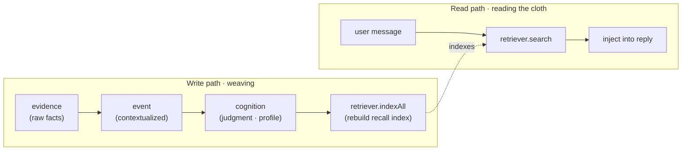

<div align="center">

# 🧵 MemoWeft

**Weave scattered evidence into a model-independent, traceable map of who your user is.**

*Evidence is the weft; the cognitive discipline is the warp; your user profile is the cloth.*


**English** | [简体中文](./README.zh-CN.md)

</div>

---

> ⚠️ **Experimental · early alpha.** The core works and is tested (**54 passing**), but interfaces may still change — not production-ready yet.

## 🧭 What it is

MemoWeft is the **user-cognition layer your LLM app wears on the outside**.

It continuously receives user-authorized conversation and behavior evidence, and distills your understanding of a person into a cognitive asset that is **independent of the model, traceable, evolvable, and portable**. When your app needs it, MemoWeft hands back user context — each piece carrying a confidence score and a boundary.

It is a **library you `import`**, not an app. To be clear about the edges:

- ❌ It does **not** chat, roleplay, or render any UI.
- ❌ It does **not** decide your assistant's tone or persona.
- ❌ It does **not** own your privacy or security policy — the host does.
- ✅ It **does** turn `evidence → event → cognition` into a confidence-scored, source-traceable profile of the user, and gives it back on request.

---

## Why MemoWeft

Swap the model and the memory is gone. Stuff context into a prompt and it is neither traceable nor portable — you can't tell *why* the assistant believes something, and you can't carry that understanding to the next model.

MemoWeft treats the understanding of a user as a **first-class, durable asset** rather than a throwaway prompt:

- **Cross-model portable** — the cognitive layer is plain data in SQLite, not baked into any model's weights. Change the LLM, keep the user.
- **Traceable** — every judgment about the user links back to the raw evidence that formed it. Nothing is a black box.
- **Woven, not dumped** — fragments of memory are *woven* into a multi-dimensional picture, not appended to an ever-growing prompt.

It is **not just another vector-memory store.** The real difference is **cognitive discipline** — the rules that decide what MemoWeft is allowed to believe (see below).

---

## 📐 Cognitive discipline (the actual difference)

This is what makes MemoWeft more than a note pile. Five rules govern what gets believed:

- **Recorded ≠ believed.** What the LLM *infers* enters as a low-confidence candidate, never as fact.
- **No system self-corroboration.** The assistant's own output and the user's silence are **not** evidence.
- **Conflicts are exposed, not auto-resolved.** When two signals disagree, MemoWeft flags the conflict instead of quietly picking a winner.
- **Confidence is computed by MemoWeft, not self-reported by the LLM.** The model doesn't get to grade its own certainty; MemoWeft derives it from source strength and supporting evidence.
- **Typed expiry.** Fleeting states (moods) fade fast; explicit preferences don't. Confidence decays on a per-type half-life, computed at read time.

### MemoWeft vs. a plain memory store

| | Typical vector / memory store | MemoWeft |
| --- | --- | --- |
| Conflicting info | overwrite / keep latest | **conflict exposed**, not silently merged |
| Trust | stored = treated as true | **recorded ≠ believed** — confidence is *computed*, not assumed |
| The model's own guesses | may slip in as fact | **no self-corroboration** — only real evidence counts |
| Expiry | permanent | **typed expiry** — moods fade fast, preferences persist |

---

## 🧵 Core concept: three layers

MemoWeft weaves in one direction and reads back in another.



Read as: **evidence** is the *weft* (raw threads fed in — the user's own words and observed behavior), the **cognitive discipline** is the *warp* (the fixed structural rules), and the **cognition layer** is the *cloth* — your understanding of the person, woven from every thread and traceable back to it.

| Layer | Plain meaning |
| --- | --- |
| **evidence** | The single source of truth. Raw material only — what was said or observed. No judgments stored here. |
| **event** | Evidence placed in context — a small, situated summary of what happened. |
| **cognition** | The judgment layer — a multi-dimensional user profile, each entry with a confidence score and links back to its evidence. |

Read and write are **decoupled**: reads are light and synchronous; writes are batched and asynchronous, so profile updates never block a reply.

---

## ⚡ Quick start

> **Requirements:** Node ≥ 18 (built on `node:sqlite`, `node:http`, `node:fs` — **zero runtime dependencies**), TypeScript.

```bash
npm install memoweft
```

Configure a model and an embedder in your `.env` (see [Configuration](#configuration)). Then wire the three stores, write a piece of evidence, build the profile, and recall it in a reply:

```ts
import {
  SqliteEvidenceStore,
  SqliteEventStore,
  SqliteCognitionStore,
  VectorRetriever,
  OpenAICompatEmbedder,
  loadEmbedConfig,
  loadLLMPool,
  updateProfile,
  Conversation,
} from 'memoweft';

// 1) Three data layers, backed by SQLite.
const evidenceStore = new SqliteEvidenceStore('./memoweft.db');
const eventStore = new SqliteEventStore('./memoweft.db');
const cognitionStore = new SqliteCognitionStore('./memoweft.db');

// 2) Models: a pool (chat vs. write) + an embedder for semantic recall.
const pool = loadLLMPool();
const embedder = new OpenAICompatEmbedder(loadEmbedConfig()!);
const retriever = new VectorRetriever('./memoweft-vectors.db', embedder);

const subjectId = 'user-42';

// 3) WRITE: store the user's own words as evidence (spoken = highest source strength).
evidenceStore.put({
  subjectId,
  sourceKind: 'spoken',
  hostId: 'my-app',
  rawContent: 'I only drink decaf after 3pm — caffeine wrecks my sleep.',
});

// 4) Weave: distill → consolidate → attribute → rebuild recall index.
await updateProfile(subjectId, {
  evidenceStore,
  eventStore,
  cognitionStore,
  retriever,
  llm: pool.for('write'),
});

// 5) READ: recall relevant cognition and inject it into a reply.
const convo = new Conversation({
  store: evidenceStore,
  retriever,
  cognitionStore,
  llm: pool.for('chat'),
});
const turn = await convo.handle('Recommend me an afternoon drink', { subjectId });
console.log(turn.reply);          // reply informed by the recalled preference
console.log(turn.recall);         // which cognition entries were injected, with scores
```

No embedder configured yet? Swap `VectorRetriever` for `NullRetriever` — writes still land as evidence, recall simply returns nothing (equivalent to plain conversation).

Want to see it running first — or don't want to touch code at all? MemoWeft ships an **optional local web UI** (see below).

## 🖥️ Experience layer (optional web UI)

Two kinds of reader are welcome: **"I just want to deploy and try it"** → use the setup wizard; **"I want to integrate it into my own LLM app"** → the [Quick start](#-quick-start) above is your path.

Beyond `import`-ing the library, MemoWeft ships an optional local web UI — a good way to *feel* what it does before wiring it in. Three modes, one page:

- **⚙️ Setup wizard** — fill in your model / embedder keys through a guided form (every field explained in plain words), and it generates a ready-to-paste `.env`. No hand-editing config.
- **💬 User-experience mode** — chat and hand it a few facts, then watch it slowly build a plain-language picture of *what it understands about you* (all internal scores hidden).
- **🎛️ Developer mode** — every tunable in `src/config.ts` (recall `topK`, confidence half-lives, attribution thresholds…) exposed as live knobs; turn one, see the effect.

<p align="center">
  
  
  
</p>

```bash
cp .env.example .env      # fill in your keys — or let the setup wizard do it
npm run experience        # → http://localhost:7888  (alias of `npm run testbench`)
```

The UI is **optional and not a core dependency** — MemoWeft stays a library you `import`. Set `MEMOWEFT_EXPERIENCE_UI=off` in `.env` to run library-only, without starting the web server.

---

## Configuration

MemoWeft reads models from environment variables. **Prefer the `MEMOWEFT_*` prefix; the legacy `DLA_*` prefix still works** (read `MEMOWEFT_*` first, fall back to `DLA_*`).

| Purpose | Variables |
| --- | --- |
| Chat LLM (read path) | `MEMOWEFT_LLM_BASE_URL` · `MEMOWEFT_LLM_API_KEY` · `MEMOWEFT_LLM_MODEL` |
| Write LLM (write path, optional — falls back to chat) | `MEMOWEFT_WRITE_LLM_BASE_URL` · `MEMOWEFT_WRITE_LLM_API_KEY` · `MEMOWEFT_WRITE_LLM_MODEL` |
| Embedder (semantic recall) | `MEMOWEFT_EMBED_BASE_URL` · `MEMOWEFT_EMBED_API_KEY` · `MEMOWEFT_EMBED_MODEL` |

All three groups accept OpenAI-compatible endpoints, so local (Ollama, LM Studio) and cloud both work. Tunable parameters — recall `topK` (5), confidence half-lives, batch size for profile updates (5), and more — live in `src/config.ts`.

> **Local or cloud is the host + user's call, not the library's.** MemoWeft only keeps the switch open: a swappable model pool (`llmPool`) and a per-evidence authorization bit (`allowCloudRead`). It does not decide your privacy or security policy.

See [`docs/INSTALL.md`](./docs/INSTALL.md) for the full env reference.

---

## 🔌 What it does / doesn't do

| MemoWeft (the library) | The host (your app) |
| --- | --- |
| Ingests evidence, weaves the three layers, computes confidence, exposes traceable user context | Owns chat, persona, tone, and UI |
| Keeps the model swap-open (`llmPool`) and records an authorization bit per evidence (`allowCloudRead`) | **Owns the privacy & security policy** — what goes local vs. cloud, what is stored at all |
| Hands back `who the user is` on request | Decides *when* and *how* to use it |

Main exports (see [`docs/integration.md`](./docs/integration.md) for the full table and signatures, all drawn from [`src/index.ts`](./src/index.ts)):

- **Write path** — `SqliteEvidenceStore`, `ingestObservations`, `updateProfile` (one call: `distill → consolidate → attribute → index`)
- **Read path** — `Conversation.handle`, `VectorRetriever` / `NullRetriever`
- **Models** — `loadLLMPool`, `OpenAICompatClient`, `OpenAICompatEmbedder`
- **Advanced** — `attribute`, `proposeAsk`, `revisitConflicts`, `expire`, `aggregateTrends`, `computeConfidence`

---

## Project status

**Alpha / early.** The first core skeleton is in place and green; the algorithms and cognitive discipline are real and tested. Interfaces may still move.

**Done**
- Phases 0–4B: evidence layer, profile + recall, correction loop, attribution + proactive asking, periodic background (decay / expiry / recall gating / conflict revisit / trends).
- Phase 4-A tier 1: behavior-observation intake (`ingestObservations` + active-window → `observed` evidence).
- Batched profile updates + a configurable, independent write-path model (`llmPool`).
- Verified end-to-end against a cloud model, dogfooded, and **54 tests passing** (`npm test`).

**Not yet**
- Phase 4-A tier 2: real behavior collectors (only a skeleton exists).
- Recall similarity-threshold gating and further recall refinement.

Status is derived from [`STATE.md`](./STATE.md).

---

## Documentation

| Doc | What's inside |
| --- | --- |
| [`docs/INSTALL.md`](./docs/INSTALL.md) | Install, configure `.env` (every env var), run tests, launch the testbench |
| [`docs/architecture.md`](./docs/architecture.md) | Three layers, read/write decoupling, swappable parts, cognitive-discipline details, the warp/weft table |
| [`docs/integration.md`](./docs/integration.md) | Host integration guide + the full export table |
| [`docs/MAINTENANCE.md`](./docs/MAINTENANCE.md) | AI-maintenance strategy: issue → plan → implement → three-green → docs-sync |
| [`docs/PUBLISHING.md`](./docs/PUBLISHING.md) | Packaging & npm release flow |
| [`examples/minimal.ts`](./examples/minimal.ts) | The runnable minimal example above |
| [`AGENTS.md`](./AGENTS.md) · [`CONTRIBUTING.md`](./CONTRIBUTING.md) | AI-maintainer working contract & contribution guardrails |

---

## Contributing

MemoWeft is documented to be **AI-maintainable**: layered docs (`STATE.md` whiteboard, `docs/项目地图.md` design master, `LOG.md` history) plus a working contract in [`AGENTS.md`](./AGENTS.md). Any code change must keep three checks green: `npm run typecheck && npm test && npm run build`. See [`CONTRIBUTING.md`](./CONTRIBUTING.md).

## License

[MIT](./LICENSE) © 2026 MemoWeft contributors.

## Acknowledgements

Independently built, drawing on ideas from **Mem0** and **Graphiti** — interfaces kept isolated so parts stay swappable.
