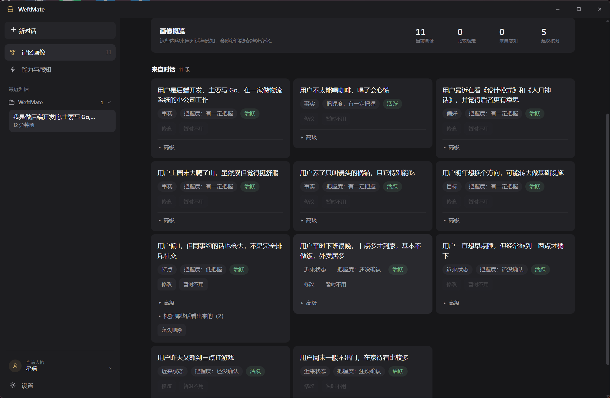
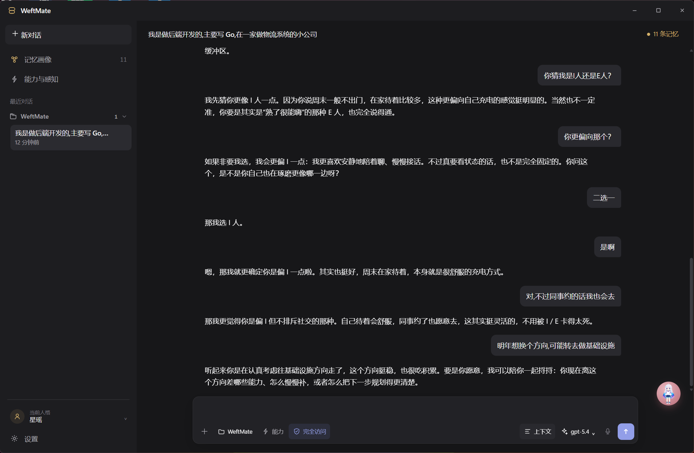

<div align="center">

<picture>
  <source media="(prefers-color-scheme: dark)" srcset="./assets/hero-dark.svg">
  <source media="(prefers-color-scheme: light)" srcset="./assets/hero-light.svg">
  
</picture>

# MemoWeft

### Give your AI a memory—without turning its guesses into your facts.

MemoWeft is an open-source long-term memory engine for TypeScript AI applications. It keeps what users said, what systems observed, what models inferred, and what remains conflicted as distinct records—so memory can be inspected, corrected, managed, and moved between hosts in SQLite controlled by your application.

[](https://www.npmjs.com/package/memoweft)
[](https://www.npmjs.com/package/memoweft?activeTab=versions)
[](https://github.com/memoweft/memoweft/actions/workflows/ci.yml)
[](./docs/INSTALL.md)
[](./LICENSE)

[Why](#why-ai-memory-needs-a-paper-trail) · [Offline demo](#try-it-without-an-api-key) · [Quickstart](#quickstart) · [Integrations](#integrations) · [Trust](#trust-privacy-and-local-boundaries) · [Docs](#documentation-and-community)

**English** · [简体中文](./README.zh-CN.md)

</div>

> [!IMPORTANT]
> MemoWeft is a library your application imports—not a chat product, hosted memory service, persona framework, vector database, or agent framework.

## Why AI memory needs a paper trail

AI can already hold a convincing conversation. What it often lacks is reliable continuity.

Across conversations, important context can disappear. New information may quietly replace old information. A model's guess may return later as if the user had stated it. Move to another model or host, and the accumulated memory may be left behind.

MemoWeft does not ask a model to declare the truth. It preserves where information came from, when it appeared, what contradicts it, and why a memory was formed—so applications and users can inspect the path from evidence to recall.

<table>
  <tr>
    <td width="33%" valign="top">
      <strong>Evidence stays evidence</strong><br><br>
      User statements, observations, tool results, and model inferences keep distinct provenance.
    </td>
    <td width="33%" valign="top">
      <strong>Conflict stays visible</strong><br><br>
      Corrections retain history. Unresolved contradictions are exposed instead of silently overwritten.
    </td>
    <td width="33%" valign="top">
      <strong>Memory stays yours</strong><br><br>
      Hosts can inspect, manage, export, validate, and import versioned memory bundles.
    </td>
  </tr>
</table>

Confidence is computed by rule rather than copied from a model's self-assessment. Transient states can age faster than durable facts and preferences. Built-in ingestion paths do not turn an assistant's own reply into user evidence simply because the assistant said it.

[Explore the six memory-discipline rules](./docs/concepts/README.md) · [Read the architecture](./docs/internals/architecture.md)

## Try it without an API key

With Node 24 installed:

```bash
git clone https://github.com/memoweft/memoweft.git
cd memoweft
npm ci
npm run build
node examples/no-key-demo.ts
```

After dependencies are installed, this deterministic demo needs no API key, makes no network calls, uses an in-memory database, and writes nothing to disk.

```text
[limited   ] conf  600/1000  The user lives in Osaka  — stated memory
[conflicted] conf  480/1000  The user lives in Tokyo  — conflict kept, not overwritten
[candidate ] conf  200/1000  The user probably works somewhere central  — guess (low confidence)

Summary: 3 cognitions, 1 in conflict-exposed state; inference remains labeled and rule-scored separately from stated memory.
Done. (in-memory database — nothing written to disk)
```

This proves MemoWeft's memory rules; it is not a model-quality benchmark. For correction history and typed decay as well, run `npm run demo`.

[Read the four-scene walkthrough](./docs/demo-script.md) · [Inspect the demo source](./examples/no-key-demo.ts)

## What it looks like in a product

[WeftMate](https://www.weftmate.com/) is a desktop product built on MemoWeft. It turns the Core memory model into a visible profile, source trail, conflict view, and user-facing controls.

The screenshots below show **WeftMate's UI**, not UI bundled with MemoWeft Core. MemoWeft provides the memory layer and portable data contract; product experience remains the host application's responsibility.

<table>
  <tr>
    <td width="50%" valign="top">
      
    </td>
    <td width="50%" valign="top">
      
    </td>
  </tr>
  <tr>
    <td valign="top"><strong>Know what a memory came from.</strong> Each item can expose its type, confidence tier, and source trail.</td>
    <td valign="top"><strong>Resolve short replies before storing them.</strong> A brief confirmation does not promote the assistant's proposal into user evidence.</td>
  </tr>
</table>

[See the evidence graph](./assets/weftmate-memory-graph.png) · [See portable-data controls](./assets/weftmate-data-portability.png) · [Run the reference host](./docs/reference-host.md)

## Quickstart

Node 24+ is the simplest path:

```bash
# Current stable release
npm install memoweft

# Or opt into the 1.0 release candidate
npm install memoweft@rc
```

On Node 20 or 22, also install the optional SQLite driver:

```bash
npm install better-sqlite3
```

Save as `quickstart.mjs`:

```js
import { createMemoWeftCore } from 'memoweft';

const core = createMemoWeftCore({ dbPath: ':memory:' });

await core.ingestUserMessage({
  subjectId: 'alice',
  content: 'I only drink decaf after 3pm—caffeine wrecks my sleep.',
});

for (const item of core.memory.listEvidence({ subjectId: 'alice' })) {
  console.log(item.sourceKind, '·', item.rawContent);
}

core.close();
```

Run it:

```bash
node quickstart.mjs
```

Storing and reading raw evidence needs no model or network. Turning evidence into a profile, separating guesses from stated facts, and recalling it into later conversations requires a chat model. Embeddings are optional; without them, Core normally uses local FTS5 keyword recall.

[Continue with the five-minute guide](./docs/getting-started.md)

## How it works

MemoWeft keeps the journey from source material to recalled context explicit:

```text
user words · observations · tool results
                  │
                  ▼
              evidence
                  │  provenance retained
                  ▼
                event
                  │
                  ▼
              cognition  ◀── corrections and conflicts
                  │
                  ▼
               recall
```

The supported application path is the `createMemoWeftCore()` facade. Lower-level exports exist for advanced composition and carry documented stable, experimental, or internal support tiers.

[API surface and tiers](./docs/reference/api-surface.md) · [Memory surface contract](./docs/reference/memory-surface-contract.md)

## Is MemoWeft a fit?

| Choose MemoWeft when you need…                                             | Choose another layer when you need…                                                   |
| -------------------------------------------------------------------------- | ------------------------------------------------------------------------------------- |
| Long-term user memory across conversations, models, or hosts               | Only short-term chat history or general document RAG                                  |
| Provenance, correction history, conflict visibility, and controlled recall | A ready-made chat UI, persona, or consumer application                                |
| An embedded TypeScript library backed by SQLite                            | A hosted multi-tenant memory API or managed synchronization service                   |
| Memory the host can inspect, manage, export, and import                    | PostgreSQL or a replaceable production storage backend out of the box                 |
| Explicit controls over built-in model read paths                           | A library that supplies authentication, consent UI, compliance, or encryption at rest |

Your host remains responsible for product UX, authentication, authorization, consent, encryption, backups, logging policy, and deployment.

## Integrations

| Ecosystem                                               | Integration surface                           | Current public status                                                  |
| ------------------------------------------------------- | --------------------------------------------- | ---------------------------------------------------------------------- |
| [Vercel AI SDK](./packages/adapter-ai-sdk)              | Middleware recall and controlled persistence  | npm `0.2.1` supports Core through `0.7`; 1.0-ready source is in `main` |
| [Model Context Protocol](./packages/mcp-server)         | Stdio: five reads and three controlled writes | npm `0.2.1` supports Core through `0.7`; 1.0-ready source is in `main` |
| [Claude Agent SDK](./packages/adapter-claude-agent-sdk) | User-prompt and tool-result hooks             | Source preview                                                         |
| [OpenAI Agents SDK](./packages/adapter-openai-agents)   | `run()` wrapper and model-input filter        | Source preview                                                         |
| [LangChain](./packages/adapter-langchain)               | v1 middleware, retriever, and callback paths  | Source preview                                                         |
| [Mastra](./packages/adapter-mastra)                     | Processor-based read/write integration        | Source preview                                                         |
| [LlamaIndex.TS](./packages/adapter-llamaindex)          | Memory block and stream tap                   | Legacy; upstream archived                                              |

Published packages and repository source move on independent release schedules. Check the installed release's npm metadata and package README for its exact compatibility range. Source previews are not presented as npm-installable until released.

[Vercel AI SDK recipe](./docs/recipes/vercel-ai-sdk.md) · [MCP recipe](./docs/recipes/mcp-server.md) · [Integration guide](./docs/integration.md)

## Trust, privacy, and local boundaries

MemoWeft is local-first through inspectable boundaries—not through a promise that data can never leave the device.

- Memory is stored in an application-selected SQLite database; no managed memory service is required.
- Raw evidence can be stored and read fully offline, and the repository includes a deterministic no-key demo.
- Profile formation needs a chat model. Hosts may use a cloud or local OpenAI-compatible endpoint.
- `allowCloudRead` filters evidence for MemoWeft's built-in cloud write-model prompts. It is not access control and does not govern custom code, recall, MCP tools, adapters, exports, or logs.
- Observations and tool results default to ineligible for built-in cloud write prompts, but the host still owns consent, review, and authorization-change flows.
- MemoWeft does not encrypt the SQLite file. Authentication, tenant isolation, encryption at rest, backups, logging, and compliance remain host responsibilities.
- Forced removal of one evidence item removes its dependent derived events and cognitions and leaves an audit tombstone; it is not per-row physical erasure. Use `resetSubject` for a subject-level clear, and handle external indexes, logs, and backups at the host layer.

CI verifies offline regressions, API snapshots, runnable documentation snippets, builds, and Node compatibility. Published evaluation results document both their methodology and what they do not measure.

[Evaluation protocol](./BENCHMARKS.md) · [API stability](./docs/STABILITY.md) · [Deployment and privacy](./docs/deployment.md) · [Security policy](./.github/SECURITY.md)

## Project status and roadmap

MemoWeft is library-first and Core 1.0 is currently a release candidate. Install `memoweft@rc` to evaluate it; npm's default `latest` tag remains on the current stable line until GA.

Stable, experimental, and internal surfaces are documented separately. After 1.0, breaking a stable symbol requires a major release and prior deprecation; experimental interfaces may still change in a minor release with notice. The Python package remains an experimental parity implementation rather than a feature-complete stable SDK.

**Now:** finish Core 1.0, publish the 1.0-compatible integration updates, preserve Node 20/22/24 coverage, expand reproducible evaluation artifacts, and complete portable-bundle parity across TypeScript and Python.

[Roadmap](./ROADMAP.md) · [Changelog](./CHANGELOG.md) · [Stability policy](./docs/STABILITY.md)

## Documentation and community

- [Getting started](./docs/getting-started.md) — from first evidence to recalled profile
- [Concepts](./docs/concepts/README.md) — six memory-discipline rules
- [Examples](./examples) — Core, management, plugins, and portable bundles
- [Documentation index](./docs/README.md) — reference, recipes, deployment, and internals
- [GitHub Discussions](https://github.com/memoweft/memoweft/discussions) — usage help and design conversations
- [Issues](https://github.com/memoweft/memoweft/issues) — reproducible bugs and concrete feature requests
- [Contributing](./CONTRIBUTING.md) — development setup and review expectations
- [Support](./SUPPORT.md) — where to ask and what information to include

Contributions are welcome beyond Core code: clearer examples, framework integrations, platform testing, reproducible evaluation cases, and reviews of provenance, conflict, deletion, and privacy boundaries.

If you believe AI memory should be traceable, correctable, and portable—not an invisible black box—**star MemoWeft**, run the offline demo, or tell us what kind of memory experience you are building.

## License

[MIT](./LICENSE) © 2026 MemoWeft contributors.
