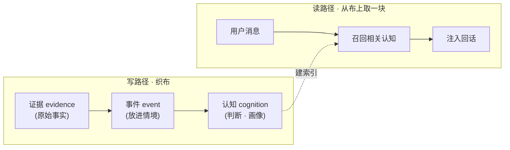

<div align="center">

# 🧵 MemoWeft

### 给 AI 装一块长期记忆——记住用户是谁，还分得清哪些是事实、哪些只是猜的，换个模型也带得走。

*把一条条零散的记忆线索，织成一张「这个人是谁」的布——但不假装每根线都一样可信。*

[](https://www.npmjs.com/package/memoweft)

[](https://github.com/memoweft/memoweft/actions/workflows/ci.yml)


[English](./README.md) | **简体中文**

</div>

---

## 换个模型，AI 就把你忘光了

你跟一个 AI 助手聊了三个月，它慢慢摸清了你的作息、口味、脾气。然后你把底层模型一换——它两眼一抹黑，重新问你"你是谁"。

把上下文一股脑塞进 prompt 也不是办法：查不到来源（它凭什么这么认为？）、搬不走（下个模型用不了）、还越塞越长越贵。

**MemoWeft 把「对一个人的了解」当成一份能长期攒、能追溯、能搬家的资产**，而不是一段用完就丢的 prompt。

它是一个你 `import` 的库，不是一个应用：**不聊天、不装人设、不做界面**——那些是宿主的活。它只干一件事：把记忆织好、存住，需要时递给你。

---

## 🚀 先跑起来看看（一条命令，看见它记住你）

不想看文档？直接跑，两分钟见分晓：

```bash
git clone https://github.com/memoweft/memoweft.git
cd memoweft
npm install
npm run build
npm start -w @memoweft/host        # → http://localhost:7788
```

打开 `http://localhost:7788`，跟它聊几句家常。聊一会儿、等它在后台整理一下，**顶栏那颗「它记住我 N 件事」就会跟着往上跳数**——那是它悄悄攒下的、对你的理解。点开就能看它到底记住了些什么。

然后是最好玩的一步：顶栏一键，把「普通助手」切成「**星瑶**」（一个陪伴型人设）——**同一份记忆，换一张脸，记忆还在**。

记忆是底座，人设只是插在上面、随时能换的一张脸——星瑶是自带的一张，你也可以换成自己的。

> 想先配好模型再玩？第一次打开会有个配置引导，填一个 OpenAI 兼容的接口就行，云端本地都成。只想当库用、几行代码接进自己的应用？往下翻到「🧩 当库用」那一节。

---

## 它凭什么不是「又一个向量记忆库」

普通记忆库的逻辑是：存进去 = 当真，来了新的就覆盖旧的。MemoWeft 不这么干——它对**「允许相信什么」很较真**。这套「认知纪律」才是它真正的不一样：

- **记 ≠ 信。** 用户亲口说的，和大模型猜的，不是一回事。模型推出来的先当**低把握度**的候选，绝不直接混成事实。
- **矛盾先摊开，不偷偷合并。** 你上周说爱喝咖啡、这周说戒了，它不会默默选一个——而是把冲突标出来，等确认。
- **把握度它自己算，不听模型自报。** 一条理解有多可信，由证据强度和反复印证程度决定，不是让大模型拍脑袋打个分。
- **情绪会淡，偏好留得住。** "今天心情差"这种会随时间衰减；"我不吃香菜"这种明确偏好不会被自动忘掉。
- **禁止自证。** 助手自己说过的话、用户的沉默，都不算证据——不然它会越聊越信自己编的。

| | 普通向量 / 记忆库 | MemoWeft |
| --- | --- | --- |
| 遇到矛盾 | 覆盖 / 取最新 | **暴露冲突**，不偷偷合并 |
| 采信 | 存了就当真 | **记 ≠ 信** |
| 模型猜测 | 可能混成事实 | **低把握度假设** |
| 过期 | 永久有效 | **分型过期**（情绪快忘、偏好留住） |

一句话：别人是「记得住」，MemoWeft 想做到的是「**记得住，还不乱用**」。

---

## ✨ 它有什么

- 🧠 **认知纪律**——记 ≠ 信、冲突暴露、把握度自算、分型过期（上面那套）。
- 🔀 **换模型不丢记忆**——认知层是 SQLite 里的普通数据，不焊死在模型权重里。换 GPT、换 Claude、换本地模型，记忆照样在。
- 🔎 **每条判断都可追溯**——它为什么这么认为？一路能回溯到形成它的那条原始证据。
- 🧩 **一套记忆，多张脸**——体验插件决定语气和人设（自带普通助手 + 星瑶两张脸），底层记忆共用。
- ☁️ **云端优先，但不无脑上云**——模型调用可以走云端，但每条证据能单独控制「能不能上云」；桌面/行为观察默认不上云。
- 👀 **能感知，不只会聊**——除了对话，还能吃「行为观察」（比如活动窗口采集插件），当作证据沉淀。
- 🪶 **零运行时依赖（代价是要 Node ≥ 24）**——存储 / HTTP / 向量全用 Node 内置的 `node:sqlite` / `node:http` / `node:fs`，一个第三方包都不装。**为什么卡 Node 24**：`node:sqlite` 到 Node 24 才转正——用它换来的是干净部署、没有依赖地狱、`npm install` 不拖进一堆传递依赖。

---

## 🧵 三层记忆，怎么织的



| 层 | 大白话 |
| --- | --- |
| **证据 evidence** | 唯一真相：用户说了什么、观察到了什么。这层只存事实，不存判断。 |
| **事件 event** | 把证据放进情境：当时发生了什么。 |
| **认知 cognition** | 判断层：一条带把握度、能溯源的用户画像。 |

读写是**解耦**的：读路径轻、同步；写路径攒批、异步——所以整理记忆不会卡住回话。

---

## 🧩 当库用（几行代码，复制就能跑）

**① 装**（需 Node ≥ 24）：

```bash
npm install memoweft
```

**② 配个对话模型**——项目根建 `.env`，填任意 OpenAI 兼容端点：

```bash
MEMOWEFT_LLM_BASE_URL=https://你的端点/v1
MEMOWEFT_LLM_API_KEY=sk-...
MEMOWEFT_LLM_MODEL=gpt-4o-mini
```

**③ 存成 `demo.mjs`，`node --env-file=.env demo.mjs` 跑**——统一入口 `createMemoWeftCore` 一行装配好三层存储、召回器、模型池（都从 `.env` 读，没配就自动降级、不崩）：

```ts
import { createMemoWeftCore } from 'memoweft';

// 一行装配：三层 store + 召回器 + 模型池全从 .env 读。
const core = createMemoWeftCore({ dbPath: './memoweft.db' });

const subjectId = 'user-42';

// 1）把用户原话存成证据。
await core.ingestUserMessage({
  subjectId,
  content: '我下午三点后只喝无咖啡因的，咖啡因毁我睡眠。',
});

// 2）整理成带把握度的画像（攒批写路径）。
await core.updateProfile({ subjectId });

// 3）回话时召回相关用户上下文并注入。
const turn = await core.handleConversationTurn({
  subjectId,
  message: '下午推荐我喝点什么？',
});
console.log(turn.reply);   // 回话里会带上"你下午不喝含咖啡因的"
console.log(turn.recall);  // 这轮召回并注入了哪些理解

core.close();
```

> TypeScript 项目另需 `@types/node@^24`（库的公开类型里有 `node:sqlite`）。没配嵌入器也能跑：召回自动降级为空，证据照写，只是回话不做语义召回。仓库内的可跑版本见 [`examples/minimal.ts`](./examples/minimal.ts)；想直接用底层部件（`openStores` / `Conversation` / `updateProfile` / 召回器）见 [`docs/integration.md`](./docs/integration.md)。

---

## ☁️ 模型部署：云端优先，但不是无脑上云

默认接入体验是**云端友好**：填个 OpenAI 兼容的云端接口就能先跑起来，不用一上来就装本地模型。但这不等于所有原始证据都能直接发云端——边界是：

- **模型调用可以云端优先。** 对话、写路径、归因、趋势、嵌入都能指向云端 OpenAI 兼容接口。
- **证据决定能不能上云。** 每条 evidence 带 `allowCloudRead` 之类的授权位。
- **行为观察默认保守。** 桌面窗口、屏幕、剪贴板、文件、健康/睡眠等观察，默认**不上云**，除非宿主明确征得同意。
- **同意权在宿主。** MemoWeft 只给模型开关和过滤钩子；隐私政策、同意 UI 归宿主。

| 模式 | 适合谁 | 说明 |
| --- | --- | --- |
| **Cloud-first** | Demo、原型、日常开发接入 | 对话 / 写路径 / 嵌入都走云端，最快跑起来 |
| **Cloud-guarded** | 用云端模型的真实应用 | 仍用云端模型，但 `allowCloudRead=false` 的证据会被过滤掉 |
| **Hybrid / 本地敏感** | 隐私敏感的桌面助手 | 敏感观察留本地，低风险调用可走云端 |

完整说明见 [`docs/deployment.md`](./docs/deployment.md)。

---

## ⚙️ 配置

从环境变量读模型。推荐 `MEMOWEFT_*` 前缀；旧的 `DLA_*` 仍兼容。

| 用途 | 变量 |
| --- | --- |
| 对话模型 | `MEMOWEFT_LLM_BASE_URL` · `MEMOWEFT_LLM_API_KEY` · `MEMOWEFT_LLM_MODEL` |
| 写路径模型 | `MEMOWEFT_WRITE_LLM_BASE_URL` · `MEMOWEFT_WRITE_LLM_API_KEY` · `MEMOWEFT_WRITE_LLM_MODEL` |
| 嵌入器 | `MEMOWEFT_EMBED_BASE_URL` · `MEMOWEFT_EMBED_API_KEY` · `MEMOWEFT_EMBED_MODEL` |

三组都接受 OpenAI 兼容接口。云端最省事；Ollama、LM Studio 等本地端点也支持。完整 env 说明见 [`docs/INSTALL.md`](./docs/INSTALL.md)。

---

## 🔌 它做什么 / 不做什么

| MemoWeft（库） | 宿主应用 |
| --- | --- |
| 摄入证据、织三层、算把握度、提供可溯源的用户上下文 | 聊天、人设、语气、界面、什么时候开口 |
| 保留模型可切换，记录 evidence 级授权 | 隐私政策、同意 UI、到底存不存 |
| 按请求把相关用户上下文递回去 | 决定怎么用（回话 / 工具调用 / 桌面助手 / Agent） |

主要导出见 [`src/index.ts`](./src/index.ts)，接入说明见 [`docs/integration.md`](./docs/integration.md)。

---

## 📦 项目状态

**早期 alpha。** Core、一个参考宿主、头两个插件都已就位并有测试；算法和认知纪律是真的。接口还可能动。

**已经能用**

- **认知内核**——证据 → 事件 → 认知三层、画像 + 召回、纠正闭环、归因 + 主动询问、周期后台（衰减、分型过期、召回门控、冲突复看、趋势）。
- **统一入口**——`createMemoWeftCore` + 受控记忆管理 API（标失效 / 授权 / 安全删除 / 合并 / 归档 / 完整性检查），宿主不直接碰底层存储。
- **可迁移与图谱**——便携记忆包（导入 / 导出 / 校验，保真 + 幂等）+ 图谱后端 payload。
- **Cloud Guard**——写 / 趋势 / 归因路径上云过滤。
- **参考宿主**（`apps/memoweft-host`）——聊天、配置向导、记忆管理页、多会话、备份 / 恢复、恢复出厂，全走 Core 公开面。
- **体验插件契约 v1**——同一 core 上可换人设（普通助手 + 星瑶）。
- **采集插件**——活动窗口采集器独立成包（`@memoweft/collector-active-window`），经宿主 `/api/observe` 落库。
- **已发布到 npm**——`npm install memoweft`（首版 `0.1.0`）。
- **Schema 版本化 + 迁移器**——`PRAGMA user_version` + 迁移运行器（事务化、自动备份、dry-run）；0.1.0 老库无损打开。已在 `main`，随 `0.2.0` 发布。

**还没做**

- 图谱前端（后端 payload 已就绪）。
- 召回精化（如相似度阈值门控）。

状态来源见 [`docs/internal/STATE.md`](./docs/internal/STATE.md)。往哪走、以及为什么"库为主、Host 当演示",见 [`ROADMAP.md`](./ROADMAP.md)。

---

## 📚 文档

| 文档 | 内容 |
| --- | --- |
| [`docs/INSTALL.md`](./docs/INSTALL.md) | 安装、配 `.env`、跑测试、起宿主 / 测试台 |
| [`docs/deployment.md`](./docs/deployment.md) | 云端 / 云守护 / 混合部署与隐私模式 |
| [`docs/architecture.md`](./docs/architecture.md) | 三层数据、读写解耦、认知纪律、可替换点 |
| [`docs/integration.md`](./docs/integration.md) | 宿主接入指南 + 导出表 |
| [`docs/naming.md`](./docs/naming.md) | 双语命名与定位口径 |
| [`plugins/collector-active-window/README.md`](./plugins/collector-active-window/README.md) | 活动窗口采集插件（采集 → 宿主 → core 数据流） |
| [`docs/PUBLISHING.md`](./docs/PUBLISHING.md) | 打包和 npm 发布流程 |
| [`examples/minimal.ts`](./examples/minimal.ts) | 可运行最小示例 |

内部设计笔记与开发白板（项目地图、路线、`STATE` / `LOG`）在 [`docs/internal/`](./docs/internal/)——是「项目怎么造的」背景，用库不需要读。

---

## 🤝 参与

MemoWeft 主要**由 AI 维护**，文档分层就是为了让接手的 AI（和人）低成本读懂、按同一套规矩改。任何代码改动都要保持三绿：

```bash
npm run typecheck && npm test && npm run build
```

工作契约见 [`AGENTS.md`](./AGENTS.md)，硬规矩见 [`CONTRIBUTING.md`](./CONTRIBUTING.md)。

## License

[MIT](./LICENSE) © 2026 MemoWeft contributors.

## 致谢

独立构建，借鉴了 **Mem0** 和 **Graphiti** 的思路；接口保持隔离，方便后续替换。
