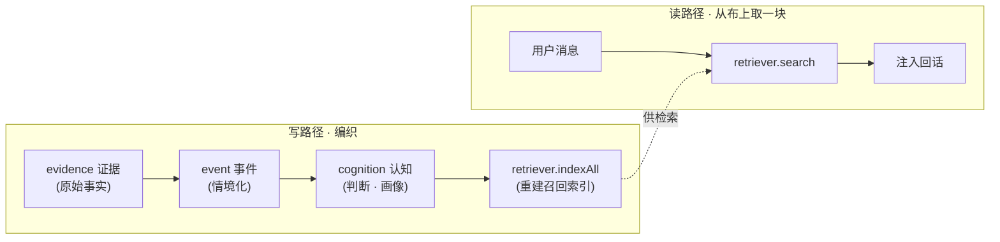
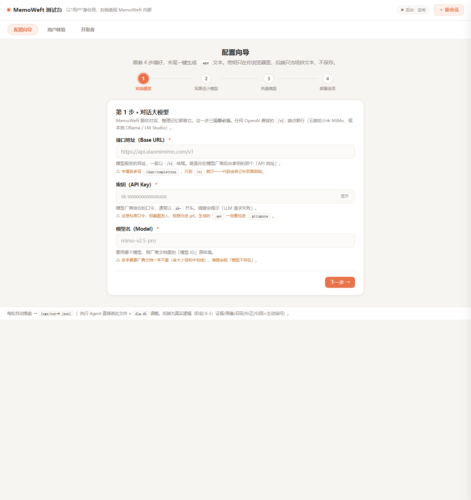
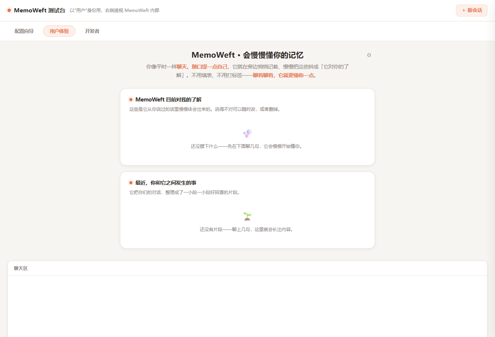
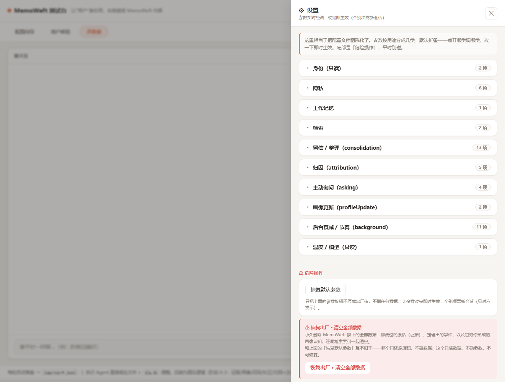

<div align="center">

# 🧵 MemoWeft

**MemoWeft 是给大模型应用用的「用户理解层」——帮 AI 助手记住用户说过的话、需要时想起相关内容；它不把每句话都当成事实，而是分清「亲口说过的」「暂时猜的」「需要再确认的」。**

*它是套在 AI 助手外面的一层，不是聊天机器人本身——温柔、人设、语气留给你的助手；它只负责把「对你的了解」备好、需要时递过去。*


[English](./README.md) | **简体中文**

</div>

---

> ⚠️ **实验性 · 早期 alpha。** 核心已成、有测试（**67 全过**），但接口可能还会变——尚未到生产级。

## 🧭 这是什么

MemoWeft 是**套在你大模型应用外面的一层「用户理解层」**（记忆 + 判断，不是普通记忆库）。它不吹「真正理解你」，只是对「允许相信什么」很克制。简单说，它做五件事：

1. **它记得你说过什么。**
2. **它知道哪些只是它暂时的猜测**，不会把猜的当成你确认过的。
3. **它发现前后矛盾会来问你**，而不是偷偷选一个信。
4. **它不会把过期的状态一直当成现在的你**——一时的情绪会淡忘，稳定的偏好留得久。
5. **它能让不同 AI 角色都继承同一份对你的了解**——换个模型、换个助手，这份理解还在。

它是一个**被 `import` 的库**，不是一个应用。先把边界划清楚，免得误解：

- ❌ 它**不**聊天、不做角色、不做任何 UI。
- ❌ 它**不**决定你助手的语气或人设。
- ❌ 它**不**替你定隐私/安全策略——那是宿主的事。
- ✅ 它**只**负责把 `证据 → 事件 → 认知`（evidence → event → cognition）三层，织成一份带把握度、能回溯来源的「对你的了解」，需要时交还给你。

> **最简接入（给开发者）。** 你其实只做两件事：**①** 聊天时把用户的话交给 MemoWeft 存成证据；**②** 回话前问 MemoWeft 要相关上下文。下面那些——事件、把握度、归因、衰减——都是这两步**背后怎么运作**，可以后面再逐步用上，不必一上来全懂。

### 名词对照（对外 ↔ 对内）

同一件事，README 里用大白话讲，代码和 API 里仍是工程词——两套名字指的是一回事。

| 对外（产品说法） | 对内（代码 / API） |
| --- | --- |
| 记忆线索 | `evidence` |
| 经历片段 | `event` |
| 理解条目（UI 里也可叫「理解卡片」） | `cognition` |
| 对你的了解 | `profile` |
| 把握度（它对这条判断有几成把握：只是猜 / 有点谱 / 比较确定） | `confidence` |
| 暂时的猜测 | `hypothesis` |
| 想起相关内容 | `recall` |
| 猜测原因 | `attribution` / `attribute` |
| 需要确认的矛盾 | `conflict` |
| 整理记忆（一次跑完 distill→consolidate→attribute→索引） | `updateProfile` |
| 整理成经历片段 | `distill` |
| 更新理解 | `consolidate` |
| 想问你的问题 | `asking` / `proposeAsk` |
| 检查矛盾 | `revisitConflicts` |
| 总结最近状态 | `aggregateTrends` |

> 代码示例、导出名、配置项一律用右列的工程词——本节只是帮你把大白话对回到 API 上。完整的命名与定位口径见 [`docs/naming.md`](docs/naming.md)。

---

## 为什么要它

换个模型，记忆就没了。把上下文一股脑塞进 prompt，既查不到来源、也搬不走——你说不清助手**为什么**这么认为，也没法把这份理解带到下一个模型上。

MemoWeft 把「对用户的理解」当成一份**头等的、能长期留存的资产**，而不是聊完就丢的 prompt：

- **跨模型可迁移**——认知层就是 SQLite 里的普通数据，不焊死在任何模型的权重里。换 LLM，用户还在。
- **可追溯**——对用户的每一个判断，都能回溯到形成它的原始证据。没有黑盒。
- **是『织』出来的，不是堆出来的**——碎片记忆被*编织*成一幅多维画像，而不是往越滚越大的 prompt 里不停追加。

它**不是又一个向量记忆库**。真正的差别是**认知纪律**——一套规定「MemoWeft 允许相信什么」的规则（见下）。

---

## 📐 认知纪律（真正的差异点）

这一节才是 MemoWeft 区别于「随手记的一堆笔记」的地方。五条规则管着「什么能被采信」：

- **记 ≠ 信。** LLM *推测*出来的，先当成低置信候选，绝不当事实。
- **禁止系统自证。** 助手自己的输出、用户的沉默，都**不算**证据。
- **冲突先暴露，不自动消解。** 两条信号打架时，MemoWeft 把冲突标出来，而不是偷偷选一个赢家。
- **把握度由 MemoWeft 自算，不听 LLM 自报。** 模型不能给自己的把握度打分；把握度由 MemoWeft 按「来源强度 + 支撑证据」自己算。
- **分型过期。** 转瞬即逝的状态（情绪）忘得快，明确的偏好不忘。置信度按每种类型各自的半衰期衰减，读时才算。

### MemoWeft vs 普通记忆库

| | 普通向量 / 记忆库 | MemoWeft |
| --- | --- | --- |
| 遇到矛盾信息 | 覆盖 / 取最新 | **冲突暴露**，不偷偷合并 |
| 采信 | 存了就当真 | **记 ≠ 信**——把握度是*算*出来的，不是默认的 |
| 模型自己的猜测 | 可能当事实混进来 | **禁自证**——只认真实证据 |
| 过期 | 永久有效 | **分型过期**——情绪忘得快，偏好留得久 |

---

## 🧵 核心概念：三层数据

MemoWeft 一个方向织进去，另一个方向读回来。



读作：**证据**是*纬线*（一根根喂进来的原料——用户的原话和被观察到的行为），**认知纪律**是*经线*（先绷好的、稳定的结构规则），**认知层**就是织出来的那块*布*——你对这个人的理解，由每一根纬线织成，也能溯回到每一根纬线。

| 层 | 大白话 |
| --- | --- |
| **evidence 证据** | 唯一的真相。只存原料——说了什么、观察到什么。这一层不存任何判断。 |
| **event 事件** | 把证据放进情境——一小段「当时发生了什么」的情境化总结。 |
| **cognition 认知** | 判断层——一份多维的用户画像，每一条都带置信度、都能链回它的证据。 |

读写是**解耦**的：读是轻量、同步的；写是攒批、异步的——所以更新画像永远不会卡住回话。

---

## ⚡ 快速开始

> **前置：** Node ≥ 24（基于 `node:sqlite`、`node:http`、`node:fs`——**零运行时依赖**），TypeScript。

MemoWeft 目前**以源码形式使用**（尚未发布到 npm）。克隆下来，先跑一遍护栏确认三绿：

```bash
git clone https://github.com/kestercarroll702-gif/memoweft.git
cd memoweft
npm install                                   # 只装 devDependencies（typescript + @types/node）
npm run typecheck && npm test && npm run build
```

> 发布到 npm 之前，下面示例里的 `from 'memoweft'` 请改用相对路径（`../memoweft/src/index.ts`）或本地 `npm install <路径>` / git submodule 引入——详见 [INSTALL.md](docs/INSTALL.md)。

在 `.env` 里配一个模型和一个嵌入器（见 [配置](#配置)）。然后接好三层 store、写一条证据、生成画像、在回话里召回它：

```ts
import {
  openStores,
  VectorRetriever,
  OpenAICompatEmbedder,
  loadEmbedConfig,
  loadLLMPool,
  updateProfile,
  Conversation,
} from 'memoweft';

// 1) 三层数据，都落在 SQLite——共用一条连接 + 一个事务。
const { evidenceStore, eventStore, cognitionStore, transaction } = openStores('./memoweft.db');

// 2) 模型：一个池（对话 vs 写路径）+ 一个做语义召回的嵌入器。
const pool = loadLLMPool();
const embedder = new OpenAICompatEmbedder(loadEmbedConfig()!);
const retriever = new VectorRetriever('./memoweft-vectors.db', embedder);

const subjectId = 'user-42';

// 3) 写：把用户亲口说的话存成证据（spoken = 来源强度最高）。
evidenceStore.put({
  subjectId,
  sourceKind: 'spoken',
  hostId: 'my-app',
  rawContent: '我下午三点后只喝无咖啡因的，咖啡因毁我睡眠。',
});

// 4) 织：distill 事件化 → consolidate 画像 → attribute 归因 → 重建召回索引。
await updateProfile(subjectId, {
  evidenceStore,
  eventStore,
  cognitionStore,
  retriever,
  transaction,
  llm: pool.for('write'),
});

// 5) 读：召回相关认知，注入回话。
const convo = new Conversation({
  store: evidenceStore,
  retriever,
  cognitionStore,
  llm: pool.for('chat'),
});
const turn = await convo.handle('给我推荐个下午喝的', { subjectId });
console.log(turn.reply);          // 带上了召回到的偏好的回话
console.log(turn.recall);         // 注入了哪些认知条目、各自相似度多少
```

还没配嵌入器？把 `VectorRetriever` 换成 `NullRetriever`——证据照样落库，召回只是返回空（等同于普通对话）。

想先看它跑起来——或者压根不想碰代码？MemoWeft 带了一个**可选的本地网页界面**（见下）。

## 🖥️ 体验层（可选的网页界面）

两类读者都照顾到：**「我只想部署、先试试」** → 用配置向导；**「我想把它集成进自己的大模型应用」** → 上面的 [快速开始](#-快速开始) 就是你的路。

除了 `import` 这个库，MemoWeft 还带一个可选的本地网页——接进应用之前，先*感受*一下它在干什么。三个模式，同一个页面：

- **⚙️ 配置向导** — 用一个带引导的表单填模型 / 嵌入器的 key（每一项都用大白话解释），填完自动生成一段可直接粘贴的 `.env`。不用手改配置。
- **💬 用户体验模式** — 聊聊天、给它点信息，看它一点点织出一份大白话的「它了解我什么」（所有内部分数都藏起来）。
- **🎛️ 开发者模式** — `src/config.ts` 里每个可调参数（召回 `topK`、置信半衰期、归因门槛…）都做成能实时拖的旋钮；调一个，立刻看效果。

<p align="center">
  
  
  
</p>

```bash
cp .env.example .env      # 填上你的 key —— 或者让配置向导替你生成
npm run experience        # → http://localhost:7888（等同 npm run testbench）
```

这个界面**可选、不是核心依赖** —— MemoWeft 仍是一个被 `import` 的库。在 `.env` 里设 `MEMOWEFT_EXPERIENCE_UI=off` 就只当库用、不起网页。

---

## 配置

MemoWeft 从环境变量读模型。**主推 `MEMOWEFT_*` 前缀；旧的 `DLA_*` 前缀仍然兼容**（先读 `MEMOWEFT_*`，读不到再回退 `DLA_*`）。

| 用途 | 变量 |
| --- | --- |
| 对话 LLM（读路径） | `MEMOWEFT_LLM_BASE_URL` · `MEMOWEFT_LLM_API_KEY` · `MEMOWEFT_LLM_MODEL` |
| 写路径 LLM（可选，缺则回退对话模型） | `MEMOWEFT_WRITE_LLM_BASE_URL` · `MEMOWEFT_WRITE_LLM_API_KEY` · `MEMOWEFT_WRITE_LLM_MODEL` |
| 嵌入器（语义召回） | `MEMOWEFT_EMBED_BASE_URL` · `MEMOWEFT_EMBED_API_KEY` · `MEMOWEFT_EMBED_MODEL` |

三组都吃 OpenAI 兼容端点，所以本地（Ollama、LM Studio）和云端都能用。可调参数——召回 `topK`（5）、各类型半衰期、攒批更新画像的 `batchSize`（5）等——都收在 `src/config.ts`。

> **本地还是云端，是宿主 + 用户的选择，不是库的。** MemoWeft 只负责把口留好：一个可切换的模型池（`llmPool`）+ 每条证据一个授权位（`allowCloudRead`）。它不替你定隐私/安全策略。

完整清单见 [`docs/INSTALL.md`](./docs/INSTALL.md)。

---

## 🔌 做什么 / 不做什么

| MemoWeft（这个库） | 宿主（你的应用） |
| --- | --- |
| 摄入证据、织三层、算置信度、交出可溯源的用户上下文 | 负责聊天、人设、语气、UI |
| 把模型口留可切换（`llmPool`）、给每条证据记一个授权位（`allowCloudRead`） | **负责隐私与安全策略**——什么走本地、什么上云端、什么根本不该存 |
| 需要时把「用户是谁」交还回去 | 决定*何时*、*怎么*用它 |

主要导出（完整表和签名见 [`docs/integration.md`](./docs/integration.md)，都取自 [`src/index.ts`](./src/index.ts)）：

- **写路径**——`SqliteEvidenceStore`、`ingestObservations`、`updateProfile`（一次调用：`distill → consolidate → attribute → index`）
- **读路径**——`Conversation.handle`、`VectorRetriever` / `NullRetriever`
- **模型**——`loadLLMPool`、`OpenAICompatClient`、`OpenAICompatEmbedder`
- **进阶**——`attribute`、`proposeAsk`、`revisitConflicts`、`expire`、`aggregateTrends`、`computeConfidence`

---

## 项目状态

**Alpha / 早期。** 第一版核心骨架已成、且是绿的；算法和认知纪律都是真的、有测试。接口可能还会动。

**已完成**
- 阶段 0–4B：证据层、画像 + 召回、纠正闭环、归因 + 主动询问、周期后台（衰减 / 过期 / 召回门控 / 冲突复看 / 趋势）。
- 阶段 4-A 档1：行为感知摄入口（`ingestObservations` + 活动窗口 → `observed` 证据）。
- 攒批更新画像 + 写路径可配独立小模型（`llmPool`）。
- 云端模型端到端跑通、dogfood 验过、**67 个测试全过**（`npm test`）。

**还没做**
- 阶段 4-A 档2：真采集器（目前只有骨架）。
- 召回相似度阈值门控，以及进一步的召回精化。

状态派生自 [`STATE.md`](./STATE.md)。

---

## 文档

| 文档 | 里面有什么 |
| --- | --- |
| [`docs/INSTALL.md`](./docs/INSTALL.md) | 安装、配 `.env`（每个 env 变量）、跑测试、起测试台 |
| [`docs/architecture.md`](./docs/architecture.md) | 三层、读写解耦、可替换部件、认知纪律细则、经线/纬线对照表 |
| [`docs/integration.md`](./docs/integration.md) | 宿主接入指南 + 完整导出表 |
| [`docs/MAINTENANCE.md`](./docs/MAINTENANCE.md) | AI 维护策略：issue → 方案 → 实现 → 三绿 → docs-sync |
| [`docs/PUBLISHING.md`](./docs/PUBLISHING.md) | 打包 & npm 发布流程 |
| [`examples/minimal.ts`](./examples/minimal.ts) | 上面那个可运行最小示例 |
| [`AGENTS.md`](./AGENTS.md) · [`CONTRIBUTING.md`](./CONTRIBUTING.md) | AI 维护者工作契约 & 贡献护栏 |

---

## 贡献

MemoWeft 的文档是按**可被 AI 维护**来写的：分层文档（`STATE.md` 白板、`docs/项目地图.md` 设计 master、`LOG.md` 历史）+ [`AGENTS.md`](./AGENTS.md) 里的工作契约。任何代码改动都必须让三道检查保持绿：`npm run typecheck && npm test && npm run build`。详见 [`CONTRIBUTING.md`](./CONTRIBUTING.md)。

## 许可证

[MIT](./LICENSE) © 2026 MemoWeft contributors。

## 致谢

自研，参考了 **Mem0** 与 **Graphiti** 的思路——接口做了隔离，部件可替换。
