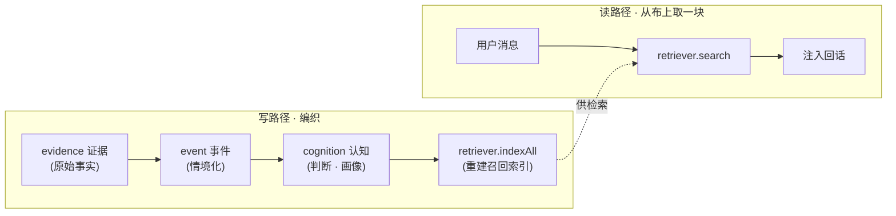

<div align="center">

# 🧵 MemoWeft

**MemoWeft 是给大模型应用用的「用户认知层」——帮 AI 助手记住用户说过的话、区分哪些是事实、哪些只是猜测，并把这份上下文带到不同模型和角色里。**

*它不是聊天机器人本身，而是套在 AI 助手外面的一层：人设、语气、桌宠、工具调用都留给宿主；它只负责把「对用户的了解」备好、需要时递过去。*


[English](./README.md) | **简体中文**

</div>

---

> ⚠️ **实验性 · 早期 alpha。** 核心已成、有测试（**87 全过**），但接口可能还会变——尚未到生产级。

## 🧭 这是什么

MemoWeft 是**套在大模型 / Agent 外部的用户认知层**。它不吹「真正理解人」，而是对「允许相信什么」很克制。

简单说，它做五件事：

- **记住用户说过什么**：用户原话会变成持久证据，不会随着 prompt 消失。
- **把猜测标成猜测**：LLM 推出来的内容先当低置信候选，不直接当事实。
- **发现矛盾会暴露**：两条信息打架时先标冲突，而不是偷偷覆盖。
- **短期状态会淡掉**：一时情绪、临时状态不会永远被当成现在的用户。
- **跨模型 / 跨角色携带理解**：换模型、换助手，这份用户认知还在。

它是一个**被 `import` 的库**，不是一个完整应用。边界先说清楚：

- ❌ 它**不**聊天、不做角色、不做 UI。
- ❌ 它**不**决定助手的语气、人设、桌宠表现。
- ❌ 它**不**替宿主制定隐私和安全策略。
- ✅ 它**只**负责把 `证据 → 事件 → 认知` 三层织成一份带把握度、可回溯来源的用户画像，并在需要时交给宿主。

> **最简接入心智模型：**宿主只做两件事：① 把用户消息 / 观察交给 MemoWeft 存成证据；② 回话前问 MemoWeft 要相关上下文。事件、置信度、归因、衰减、冲突复看，都是这两步背后的内部机制。

---

## 🔤 名词对照

| 产品说法 | 工程词 |
| --- | --- |
| 记忆线索 | `evidence` |
| 经历片段 | `event` |
| 理解条目 | `cognition` |
| 对用户的了解 | `profile` |
| 把握度 | `confidence` |
| 暂时猜测 | `hypothesis` |
| 想起相关内容 | `recall` |
| 猜测原因 | `attribution` / `attribute` |
| 需要确认的矛盾 | `conflict` |
| 整理记忆 | `updateProfile` |
| 想问用户的问题 | `asking` / `proposeAsk` |
| 检查矛盾 | `revisitConflicts` |
| 总结最近状态 | `aggregateTrends` |
| 整理成经历片段 | `distill` |
| 更新理解 | `consolidate` |

完整命名与定位口径见 [`docs/naming.md`](docs/naming.md)。

---

## 为什么要它

换个模型，记忆就没了。把上下文一股脑塞进 prompt，既查不到来源，也搬不走——你说不清助手为什么这么认为，也没法把这份理解带到下一个模型。

MemoWeft 把「对用户的理解」当成一份**可长期留存的资产**：

- **跨模型可迁移**：认知层是 SQLite 里的普通数据，不焊死在模型权重里。
- **可追溯**：每个判断都能回溯到形成它的原始证据。
- **是织出来的，不是堆出来的**：碎片记忆会沉淀成多维画像，而不是无限追加到 prompt。

它**不是又一个向量记忆库**。真正的差异是**认知纪律**：什么能信、信到什么程度、哪些需要确认、哪些会过期。

---

## 📐 认知纪律

五条规则管着「什么能被采信」：

- **记 ≠ 信。** LLM 推测出来的，先当低置信候选，绝不直接当事实。
- **禁止系统自证。** 助手自己的输出、用户沉默，都不算证据。
- **冲突先暴露，不自动消解。** 两条信号打架时先标冲突，而不是偷偷选赢家。
- **把握度由 MemoWeft 自算，不听 LLM 自报。**
- **分型过期。** 情绪、状态淡得快；明确偏好留得久。

| | 普通向量 / 记忆库 | MemoWeft |
| --- | --- | --- |
| 矛盾信息 | 覆盖 / 取最新 | **暴露冲突**，不偷偷合并 |
| 采信 | 存了就当真 | **记 ≠ 信** |
| 模型猜测 | 可能混成事实 | **低置信假设** |
| 过期 | 永久有效 | **分型过期** |

---

## 🧵 核心概念：三层数据



| 层 | 大白话 |
| --- | --- |
| **evidence 证据** | 唯一真相：用户说了什么、观察到了什么。这层不存判断。 |
| **event 事件** | 把证据放进情境：当时发生了什么。 |
| **cognition 认知** | 判断层：一条带把握度、可溯源的用户画像。 |

读写是**解耦**的：读路径轻、同步；写路径攒批、异步，所以更新画像不会卡住回话。

---

## ⚡ 快速开始

> **前置：** Node ≥ 24，TypeScript。MemoWeft **零运行时依赖**，使用 `node:sqlite`、`node:http`、`node:fs` 等 Node 内置能力。

MemoWeft 目前**以源码形式使用**，尚未发布到 npm。

```bash
git clone https://github.com/kestercarroll702-gif/memoweft.git
cd memoweft
npm install
npm run typecheck && npm test && npm run build
```

发布到 npm 之前，示例里的 `from 'memoweft'` 请用本地路径、本地 `npm install <路径>`、git submodule，或 build 后的 `dist/index.js`。详见 [`docs/INSTALL.md`](docs/INSTALL.md)。

`.env` 里配模型，嵌入器可选。然后接好三层 store，写一条证据，生成画像，再在回话里召回：

```ts
import {
  openStores,
  VectorRetriever,
  OpenAICompatEmbedder,
  loadEmbedConfig,
  loadLLMPool,
  updateProfile,
  Conversation,
} from 'memoweft';

const { evidenceStore, eventStore, cognitionStore, transaction } = openStores('./memoweft.db');

const pool = loadLLMPool();
const embedConfig = loadEmbedConfig();
const retriever = embedConfig
  ? new VectorRetriever('./memoweft-vectors.db', new OpenAICompatEmbedder(embedConfig))
  : undefined;

const subjectId = 'user-42';

evidenceStore.put({
  subjectId,
  sourceKind: 'spoken',
  hostId: 'my-app',
  rawContent: '我下午三点后只喝无咖啡因的，咖啡因毁我睡眠。',
});

await updateProfile(subjectId, {
  evidenceStore,
  eventStore,
  cognitionStore,
  retriever,
  transaction,
  llm: pool.for('write'),
});

const convo = new Conversation({
  store: evidenceStore,
  retriever,
  cognitionStore,
  llm: pool.for('chat'),
});

const turn = await convo.handle('下午推荐我喝点什么？', { subjectId });
console.log(turn.reply);
console.log(turn.recall);
```

暂时没配嵌入器也能跑：用 `NullRetriever` 或先不启用语义召回，证据和画像照样能写。

---

## ☁️ 模型部署：云端优先，但不是无脑上云

MemoWeft 的默认接入体验应该是**云端友好**：开发者填 OpenAI-compatible 云端接口，就能先跑起来，不需要一开始就装 Ollama、LM Studio 或本地 embedding。

但这不等于所有原始证据都能直接发云端。边界是：

- **模型调用可以云端优先。** 对话、写路径、归因、趋势、嵌入都可以指向云端 OpenAI-compatible endpoint。
- **证据决定能不能上云。** 每条 evidence 可以带 `allowCloudRead` 等授权位。
- **行为观察默认保守。** 桌面窗口、设备状态、屏幕 OCR、剪贴板、文件、健康 / 睡眠 / 心率等观察，默认不应上云，除非宿主明确征得用户同意。
- **宿主负责同意和策略。** MemoWeft 提供模型切换与过滤钩子；宿主负责隐私政策、UI 和用户可见的同意流程。

推荐三种模式：

| 模式 | 适合谁 | 说明 |
| --- | --- | --- |
| **Cloud-first** | Demo、原型、普通开发者接入 | 对话 / 写路径 / 嵌入都走云端，最快跑起来 |
| **Cloud-guarded** | 真实应用 | 仍用云端模型，但 `allowCloudRead=false` 的证据会被过滤 |
| **Hybrid / local-sensitive** | 隐私敏感桌面助手 | 敏感观察留本地，低风险调用可走云端 |

完整说明见 [`docs/deployment.md`](./docs/deployment.md)。

---

## 🖥️ 可选体验层：本地测试台

MemoWeft 自带一个可选本地测试台，方便你先感受它怎么工作，再接入自己的宿主。

```bash
cp .env.example .env
npm run experience
# → http://localhost:7888
```

测试台有三种模式：

- **配置向导**：填写模型 / 嵌入器 key，生成 `.env`。
- **用户体验模式**：聊天、投喂事实，看它慢慢形成用户画像。
- **开发者模式**：看证据、事件、画像、召回、归因、主动询问、后台更新和配置参数。

测试台是可选的，不是核心依赖。MemoWeft 仍然是一个被宿主 `import` 的库。

---

## 配置

MemoWeft 从环境变量读取模型配置。推荐使用 `MEMOWEFT_*` 前缀；旧的 `DLA_*` 前缀仍兼容。

| 用途 | 变量 |
| --- | --- |
| 对话模型 | `MEMOWEFT_LLM_BASE_URL` · `MEMOWEFT_LLM_API_KEY` · `MEMOWEFT_LLM_MODEL` |
| 写路径模型 | `MEMOWEFT_WRITE_LLM_BASE_URL` · `MEMOWEFT_WRITE_LLM_API_KEY` · `MEMOWEFT_WRITE_LLM_MODEL` |
| 嵌入器 | `MEMOWEFT_EMBED_BASE_URL` · `MEMOWEFT_EMBED_API_KEY` · `MEMOWEFT_EMBED_MODEL` |

三组都接受 OpenAI-compatible endpoint。云端是默认最省事的接入方式；Ollama、LM Studio 等本地端点仍然支持。

完整 env 说明见 [`docs/INSTALL.md`](./docs/INSTALL.md)。

---

## 🔌 它做什么 / 不做什么

| MemoWeft | 宿主应用 |
| --- | --- |
| 摄入证据、编织三层、计算把握度、提供可溯源用户上下文 | 负责聊天、人设、语气、UI、什么时候开口 |
| 保留模型可切换能力，并记录 evidence 级授权 | 负责隐私政策、同意 UI、到底存什么 |
| 按请求交回相关用户上下文 | 决定如何用于回话、工具调用、桌面助手或 Agent |

主要导出见 [`src/index.ts`](./src/index.ts)，接入说明见 [`docs/integration.md`](./docs/integration.md)。

---

## 项目状态

**Alpha / early.** 核心骨架已成，认知纪律和算法已有真实测试，接口仍可能移动。

**已完成**

- 阶段 0–4B：证据层、画像 + 召回、纠正闭环、归因 + 主动询问、周期后台。
- 阶段 4-A 档 1：行为观察摄入口（`ingestObservations` + 活动窗口 → `observed` 证据）。
- 攒批画像更新 + 可独立配置写路径模型。
- 框架闭环 Phase 5-A：便携记忆包（`exportBundle` / `validateBundle` / `importBundle`，保真 + 幂等 + 可迁移）。
- 已用云端模型端到端验证，dogfood，**87 个测试通过**。

**未完成**

- 阶段 4-A 档 2：真实行为采集器。
- 召回相似度阈值门控和进一步召回优化。
- 测试台导入/导出按钮与备份/恢复 API（Phase 5-B）。
- 更像用户产品的记忆管理页 + 图谱视图。

状态来源见 [`STATE.md`](./STATE.md)。

---

## 文档

| 文档 | 内容 |
| --- | --- |
| [`docs/INSTALL.md`](./docs/INSTALL.md) | 安装、配置 `.env`、跑测试、启动测试台 |
| [`docs/deployment.md`](./docs/deployment.md) | Cloud-first / Cloud-guarded / Hybrid 模型部署与隐私模式 |
| [`docs/architecture.md`](./docs/architecture.md) | 三层数据、读写解耦、认知纪律、可替换点 |
| [`docs/integration.md`](./docs/integration.md) | 宿主接入指南 + 导出表 |
| [`docs/MAINTENANCE.md`](./docs/MAINTENANCE.md) | AI 维护策略 |
| [`docs/PUBLISHING.md`](./docs/PUBLISHING.md) | 打包和 npm 发布流程 |
| [`examples/minimal.ts`](./examples/minimal.ts) | 可运行最小示例 |
| [`AGENTS.md`](./AGENTS.md) · [`CONTRIBUTING.md`](./CONTRIBUTING.md) | AI 维护者工作契约与贡献规则 |

---

## 贡献

MemoWeft 按 **AI 可维护** 的方式组织：`STATE.md` 白板、`docs/项目地图.md` 设计地图、`LOG.md` 历史记录，再加 [`AGENTS.md`](./AGENTS.md) 的工作契约。任何代码改动都要保持三绿：

```bash
npm run typecheck && npm test && npm run build
```

见 [`CONTRIBUTING.md`](./CONTRIBUTING.md)。

## License

[MIT](./LICENSE) © 2026 MemoWeft contributors.

## Acknowledgements

独立构建，借鉴 **Mem0** 和 **Graphiti** 的思想；接口保持隔离，方便后续替换。
