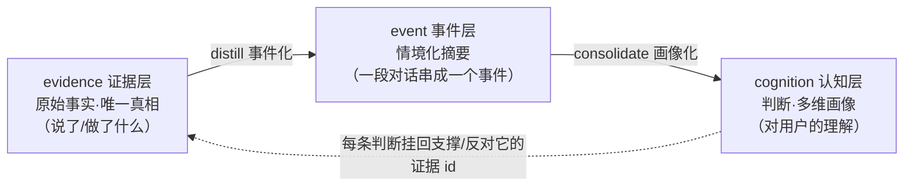
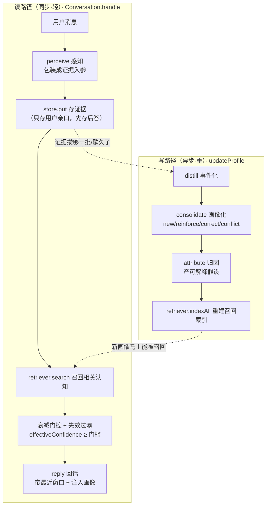
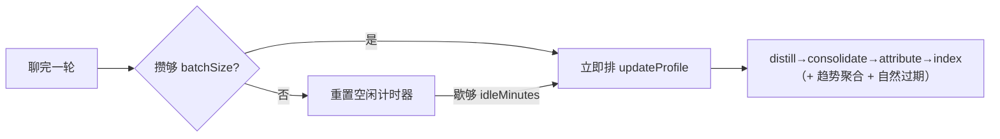
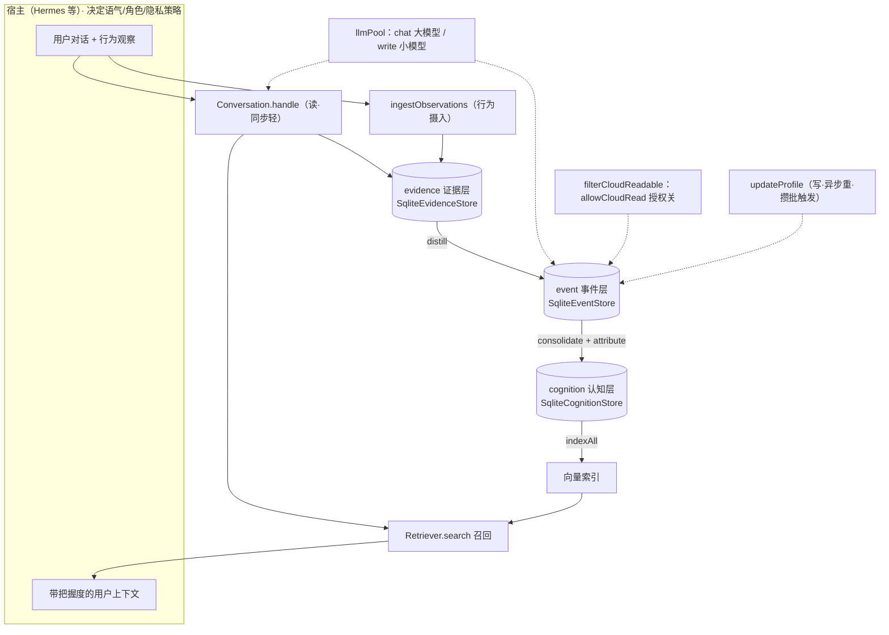

# MemoWeft 架构总览

> 本文是**对外可读**的架构文档：从三层数据模型、读写双路径，到认知纪律的落地方式，逐一对照真实代码讲清楚。
> 需要更细的机制口径（置信度算法、冲突闭环、隐私授权语义）见 [spec.md](./spec.md)；宿主怎么接见 [integration.md](./integration.md)；内部 17 格设计稿见 [项目地图.md](./项目地图.md)。

MemoWeft = **Memo（记忆）+ Weft（织布的纬线）**。织布有经线（warp，稳定的规则）和纬线（weft，横穿的证据）；纬线把一条条线**编织**成整块布。这库做的正是这件事：把零散的证据一条条**编织**成一块"认知之布"——对一个人的理解。

---

## 1. 它是什么 / 不是什么

MemoWeft 是套在大模型/Agent **外部**的"用户认知与上下文框架"，以 **TypeScript 库**的形式被宿主（如 Hermes）`import`。

- **它做**：持续接收用户授权的对话与行为证据 → 沉淀成【独立于模型、可追溯、可演化、可迁移】的认知资产 → 需要时提供带置信度和边界的用户上下文。
- **它不做**：不做聊天/角色/UI，不替宿主定语气或隐私策略。语气、角色、是否开口问、云端还是本地、给不给上云——都是**宿主 + 用户**的决定；库只负责"留好口、可切换"。

一句话：**库给"对用户的理解"，宿主决定"怎么用这份理解"。**

---

## 2. 三层数据模型

MemoWeft 的核心是把"关于一个人的信息"拆成三层，从**原始事实**逐层情境化、判断化，且**层层可溯源**：



三层各自的职责边界很硬：**记 ≠ 信**。evidence 只存"用户说了/做了什么"（事实），cognition 才存"对用户的判断"；判断永远能溯回它依据的那几条原话。

### 2.1 evidence（证据层）—— 唯一真相

代码：`src/evidence/model.ts`、`src/evidence/store.ts`

只存**原料**，不存任何判断（置信度/可信状态/适用范围都不在这层）。字段全是"关于证据的事实"：

| 字段 | 类型 | 含义 |
|---|---|---|
| `id` | string | 主键（`randomUUID`） |
| `subjectId` | string | 哪个用户的证据 |
| `sourceKind` | `'spoken' \| 'inferred' \| 'observed'` | 来源种类——**来源强度分层**：亲口 > 推测 > 观察 |
| `hostId` | string | 来自哪个宿主 |
| `originId` | string \| null | 原始消息号，**幂等防重**；有唯一索引 |
| `occurredAt` | string(ISO) | 事情**实际发生**时间 |
| `recordedAt` | string(ISO) | MemoWeft **收到并存下**的时间 |
| `rawContent` | string | 用户原话 / 原始观察 |
| `summary` | string | 召回用摘要；v1 = `rawContent` |
| `allowLocalRead` | boolean | 能否提供给本地 Agent |
| `allowCloudRead` | boolean | 能否发送给云端模型（**隐私授权位**） |
| `allowInference` | boolean | 能否据此推测画像/动机 |
| `correctsEvidenceId` | string \| null | 若在纠正旧记录，指向旧证据 |

**双时态**（借 Graphiti）：`occurredAt`（发生时）和 `recordedAt`（存入时）分开——"昨晚玩到 3:30"发生在昨晚，但可能今天才被录进来，两个时间都留着，归因才能贴合"昨晚"。

### 2.2 event（事件层）—— 情境化摘要

代码：`src/event/model.ts`、`src/event/store.ts`

事件 = 一段对话的"情境化摘要"，通过 `event_evidence` 关系表挂回它覆盖的原话证据。画像从事件生成（带上下文），但溯源仍落到原话证据。

- `Event`：`id / subjectId / summary / occurredAt / createdAt`；`occurredAt` = 覆盖证据里最早的发生时间。
- 存储侧还带一个 `consolidated` 标志位，用于"这个事件消化进画像了没"（增量更新的基础）。
- **红线**：事件摘要只含【用户的话 + 情境】，**不含助手回话**（禁止系统自证，见 §4.2）。

### 2.3 cognition（认知层）—— 判断·多维画像

代码：`src/cognition/model.ts`、`src/cognition/store.ts`

一条 `Cognition` 就是"对用户的一条判断"，多条判断组成多维画像。授权位**不在这层**（挂在 evidence），这层只存判断。

| 字段 | 类型 | 含义 |
|---|---|---|
| `contentType` | `fact \| preference \| goal \| project \| state \| trait \| hypothesis \| trend` | 内容类型（多维之一，不互斥） |
| `formedBy` | `stated \| observed \| ruled \| inferred` | 形成方式 = 来源强度（亲口 > 观察 > 规则 > LLM 推测） |
| `confidence` | number(0~1000) | 把握度，**MemoWeft 自算，非 LLM 自报** |
| `credStatus` | `candidate \| low \| limited \| stable \| conflicted` | 可信状态 |
| `scope` | string \| null | 适用场景；null = 通用 |
| `validAt / invalidAt` | string \| null | 生效/失效时间锚；**失效标记而非删除**（保留可溯源） |
| `askedAt` | string \| null | 主动询问时间戳；"问过不再问"去重用 |

溯源链存在 `cognition_evidence` 表：每条认知靠哪些证据 `support`（支持）或 `contradict`（反对）。这是"每条判断都能指到具体原话"的物理落点。

两种特殊类型值得单独说：
- `hypothesis`（可解释假设）：归因产物，从证据推"为什么"，**低置信、挂证据、可推翻**。
- `trend`（跨会话趋势）：反复出现的状态聚成的持续模式（如"最近持续低落"），基于**客观频率**用规则聚出（`formedBy=ruled`），比"特质"可信，会随好转衰减。

---

## 3. 读写双路径（读写解耦）

MemoWeft 的核心工程决策：**读同步轻、写攒批异步**。聊天时只做轻量的"存证据 + 召回注入"，重活（把对话消化成画像）攒批到后台慢慢做，不挡聊天。



### 3.1 读路径（`src/pipeline/conversation.ts`）

`Conversation.handle(userMsg)` 一轮做三件事：

1. **感知 → 存证据**：`perceive` 把用户消息包装成 `EvidenceInput`（默认 `spoken`），`store.put` 落库。**只存用户的话，助手回话不落证据**。**先存后答**——回话失败了证据也已在库。
2. **召回相关认知**：`retriever.search(userMsg, topK)` 找 top-k 相关认知。这一步**失败不挡回话**（当作无召回照常答）。召回结果还要过两道关：
   - 失效过滤：`invalidAt` 非空的（被纠正/过期的）不注入，哪怕索引还没重建。
   - **衰减门控**：把握度用**有效置信** `effectiveConfidence`（见 §4.4），低于 `minEffectiveConfidence` 的（淡了的情绪、过气的假设）直接不注入。
3. **回话**：`reply` 带最近几轮工作记忆窗口（`WorkingMemory`，纯内存 N 轮）+ 注入召回到的画像，调一次对话模型。注入时**把握度透明给模型**（"低置信的只是假设，别当定论"）。

> 读路径全程**不写画像**——它只读认知、存原始证据。把对话消化成画像是写路径的活。

### 3.2 写路径（`src/consolidation/updateProfile.ts`）

`updateProfile` 把本来分散的四步合成一个入口（宿主只调这一个），依次：`distill → consolidate → attribute → indexAll`。每步耗时记进 `timings`，供诊断"慢在哪步"。索引重建失败**不回滚画像**（索引是读路径优化，失败降级不报错）。

四步详见 §4。

---

## 4. 写路径四步 + 认知纪律

认知纪律是 MemoWeft 的核心差异——不是"多记点"，而是"**怎么记才不失真**"。五条纪律贯穿写路径每一步。

### 4.1 记 ≠ 信（LLM 推的先当低置信候选）

落点：`src/consolidation/confidence.ts`

**把握度由 MemoWeft 按规则算，绝不采信 LLM 自报。** `computeConfidence` 的规则（参数都在 `config.ts`，跑起来后校准）：

```
把握度 = 起步分(按 formedBy) + 支持证据加分(封顶) − 反对证据扣分
```

- **起步分按形成方式**（`baseByFormedBy`）：`stated:600 > ruled:450 > observed:350 > inferred:200`——LLM 推测（inferred）起步最低。
- 每多一条支持证据 `+supportStep(40)`，最多 `supportCap(5)` 条；每条反对证据 `−contradictPenalty(120)`。
- 结果钳在 `[minConfidence(50), 1000]`，恒 > 0。
- `deriveCredStatus` 按阈值把分数映成 `candidate/low/limited/stable`；有反对证据直接 `conflicted`。

**第一步 distill**（`src/distillation/distill.ts`）：把"还没整理成事件"的近期证据，按时间排好，让写路径模型总结成一段带情境的事件摘要。

### 4.2 禁止系统自证（助手输出/用户沉默不算证据）

落点：贯穿 distill / consolidate / attribute 的 prompt 与数据流。

- 只有**用户消息**落证据；助手回话永不落库（`conversation.ts`：助手回话不入证据）。
- distill 的 prompt 明令"不要出现助手的话、不加推测评价"；事件摘要只含用户内容。
- consolidate / attribute 里，**每条认知的支撑只能从"喂进 prompt 的真实原话 id"里选**——`validEvidence` 集合白名单校验，LLM 编的 id 一律丢弃，引不出真实原话的候选**直接跳过、不落库**（"无溯源不落认知"）。
- 提问（`proposeAsk`）本身不入证据；只有用户的**回答**才是新证据。

### 4.3 冲突先暴露、不自动消解

落点：`src/consolidation/consolidate.ts`

**第二步 consolidate**（画像化·增量+反证）：把【未消化的新事件 + 现有画像】给写路径模型，判断新材料对画像意味着什么，输出四类操作：

| 操作 | 含义 | 处理 |
|---|---|---|
| `new` | 新材料里有、画像没有 | 新增认知（须有可溯源原话，否则跳过） |
| `reinforce` | 新原话印证现有认知 | 补挂证据、重算把握度升 |
| `correct` | 用户**明确纠正/否定**某条认知 | 旧的标 `invalidAt` **失效保留**、采纳新的（纠正闭环） |
| `conflict` | 矛盾但**非明确纠正**（如行为 vs 旧偏好） | 标 `conflicted`，**两条都留、挂上 contradict 证据、不替换** |

关键区别：`correct` 是用户主动澄清 → 旧的让位；`conflict` 是"观察到的行为和旧偏好对不上，但用户没说要改" → **只暴露矛盾，不替宿主决定谁对**。这就是"冲突先暴露不自动消解"的物理落点。

### 4.4 分型时间策略（情绪快忘 / 明确偏好不忘）

落点：`src/background/decay.ts`（衰减）+ `src/background/expire.ts`（过期）+ `confidence.ts`（临时类封顶）

不同类型的认知，"过期速度"不一样——**不能一刀切"越久越不信"**：

- **临时类封顶**（`confidence.ts`）：`transientTypes`（如 `state`）置信封顶 `transientCap(300)`、`deriveCredStatus` 里永不进"稳定/有限"——临时情绪重复 ≠ 稳定特质，不能越攒越像定论。
- **读时衰减**（`decay.ts`）：有效置信 = `confidence × 2^(−age/半衰期)`，按距上次印证 `updatedAt` 算。**读时算、不持久化**（`confidence` 字段保持"证据强度"语义不动）。半衰期（天）按类型分：`state:1.5 / hypothesis:2 / goal,project:14 / trend:7 / trait:60`；`fact/preference` 不列 = 不衰减（明确偏好久不提也不自动忘）。
- **自然过期**（`expire.ts`）：只有临时类会自然失效——距上次印证超 `expireAfterDays`（`state:7 / hypothesis:14 / trend:30`）就标 `invalidAt`；稳定类**永不自动失效**。失效 = 标记保留可溯源，不删。

### 4.5 把握度 MemoWeft 自算（不听 LLM 自报）

见 §4.1——这是纪律 1 的另一面，值得单列强调：**任何时候 confidence 都是库按规则算的**，LLM 只提供"内容候选 + 引用哪些证据"，从不决定"这条有多可信"。

**第三步 attribute（归因）**（`src/attribution/attribute.ts`）：从一条 `state` 现象（如"昨晚没睡好"）出发，拉时间窗内的证据（含 `observed` "游戏到 3:30"），让模型推"为什么"，产出**可解释假设**：

- 假设只当假设：`formedBy=inferred`、置信封顶 `hypothesisCap(250)`——**低声说，不让它越攒越像定论**。
- 只归因**反复出现**（支撑 ≥ `minPhenomenonSupport`）的现象，一次最多 `maxPhenomenaPerRun(1)` 个（防归因爆炸）。
- 原因必须是**行为/客观观察**，**禁止"用一个抱怨解释另一个抱怨"**（state 证据只能当现象侧、不能当原因）。
- 单条假设最多挂 `maxCausesPerHypothesis(2)` 条原因证据；LLM 编的 id 一律丢弃（禁止自证）。

---

## 5. 召回

代码：`src/retrieval/`

召回底座是**可替换 seam**（`Retriever` 接口），两个方法：`indexAll`（替换式重建索引）+ `search`（top-k）。三种实现：

- `NullRetriever`：空实现——没配嵌入器时降级用它，`search` 返回 `[]`（回话不注入画像，不报错）。
- `VectorRetriever`：SQLite 存向量 + **JS 余弦相似度**，单人几千条够用，**零原生依赖**（不上 sqlite-vec）。`indexAll` 替换式重建、`search` 嵌入 query 后算余弦取 top-k。
- 未来可换 Mem0 等，只要实现接口。

`Embedder` 同样可替换（`OpenAICompatEmbedder` 打 OpenAI 兼容 `/embeddings`）；配置缺失时 `loadEmbedConfig` 返回 `null`，召回自动降级为空、不崩。

**索引由写路径重建**：`updateProfile` 末步 `indexAll` 只索引**未失效**的认知（被纠正/过期的不再被召回）。读路径只 `search`，让新画像更新完马上能被召回。

---

## 6. 攒批更新（治"勤"）

写路径是重活（要调几次模型），故意**不挡聊天**：聊天即记证据，停下来后台慢慢消化。

- 库侧：`config.profileUpdate` 给出策略参数 `batchSize(5)` 和 `idleMinutes(30)`，并暴露一次性入口 `updateProfile`。
- **触发调度归宿主**：库不自己跑定时器。参考实现见测试台 `testbench/server.mjs` 的 `scheduleBackgroundUpdate`——**攒够 `batchSize` 条新对话【立即】排更新；否则重置空闲计时、歇够 `idleMinutes` 没动静再更新一次，先到先触发**。同一用户的画像更新用一把锁串行（不能并发消化同一批事件）。



周期后台还会顺带跑 `aggregateTrends`（跨会话趋势聚合，规则筛够频才调模型）和 `expire`（临时类自然过期）。

---

## 7. 可切换部件（模型口、嵌入口、召回口）

MemoWeft 把"外部依赖"都收进可替换的 seam，宿主按需切换：

### 7.1 llmPool —— 按用途切换模型

代码：`src/llm/pool.ts`、`src/llm/client.ts`

对话和写路径共用一个大模型会互相拖累（写路径拖慢"更新画像"）。`LLMPool` 按**用途**分流：

- `pool.for('chat')`：对话大模型（质量优先），env `MEMOWEFT_LLM_*`。
- `pool.for('write')`：写路径小快模型（省时省钱），env `MEMOWEFT_WRITE_LLM_*`；**缺配则自动回退 chat**，行为同旧、不强制。

`LLMClient` 是抽象接口（`chat(messages) + callCount`），`OpenAICompatClient` 用内置 `fetch` 打 OpenAI 兼容 `/chat/completions`，**不装 SDK**（依赖取向：小而可换）。换模型只动这一处。

> **留好的口**：`LLMPool` 不写死"俩固定 client"，而是"按维度选 client"。当前维度 = 用途(chat/write)；将来"按证据 `allowCloudRead` 路由本地/云端"只需在此之上加一个 tier(local/cloud) 维度（如 `forEvidence(ev)`），不用重构。

### 7.2 双前缀 env 兼容（改名保守）

代码：`client.ts` 的 `readEnvWithFallback` + `embedder.ts`

品牌从 DLA 改名 MemoWeft，但 env 读取**双前缀兼容**：每个键先读 `MEMOWEFT_*`、读不到回退 `DLA_*`。用户现有只含 `DLA_*` 的 `.env` 零改动继续工作。九个变量都走这套：`MEMOWEFT_LLM_{BASE_URL,API_KEY,MODEL}`、`MEMOWEFT_WRITE_LLM_{...}`、`MEMOWEFT_EMBED_{...}`，旧名一一兜底。

---

## 8. 隐私 / 授权位（allowCloudRead）

代码：`src/evidence/privacy.ts`、`src/perception/ingest.ts`

隐私（用云端还是本地模型）是**宿主 + 用户的选择**，库不替宿主做安全策略，只做到"授权位真生效 + 留好切换口"。

- **三个授权位挂在 evidence**：`allowLocalRead`（给本地 Agent）、`allowCloudRead`（发云端模型）、`allowInference`（据此推画像）。
- **写路径的隐私关**：`filterCloudReadable` 把 `allowCloudRead=false` 的证据挡在【喂给云端模型的材料】之外。distill / consolidate / attribute 三处取证据喂 LLM 前都过这道关——被挡的证据既不进 prompt、也进不了合法支撑集合。
- **默认值跟随配置**：`cloudReadDefault` 跟 `privacyMode` 走（隐私模式下默认不上云）。
- **行为观察更保守**：`observedDefaults = { local:true, cloud:false, inference:true }`——`ingestObservations` 摄入的 `observed` 证据默认**本地可读、不上云、可推画像**；`Observation` 显式给了授权位则尊重显式值。

> ⚠️ 现状前提：`filterCloudReadable` **假设写路径的 LLM 是云端模型**，故按 `allowCloudRead` 筛。将来接入本地模型（本地模型可读 cloud=false 的证据）时，要改成"按当前模型是云端/本地决定筛不筛"——这正是 §7.1 llmPool 预留 tier 维度的用武之处。

---

## 9. 行为感知摄入（多源证据入口）

代码：`src/perception/ingest.ts`、`src/perception/collectors/activeWindow.ts`

除了对话，MemoWeft 也定义了"行为观察怎么进来"：`ingestObservations` 把外部采集器标准化好的 `Observation`（`kind + occurredAt + content + 可选授权位`）批量落成 `sourceKind='observed'` 的证据，带 `originId` 幂等去重。

**边界**：库只定义"观察怎么进来 + 怎么授权"，**不在库里写"怎么从操作系统抓"**——那是外挂采集器的活（`activeWindow.ts` 只留骨架）。这保证库自身干净、可移植。

---

## 10. 存储与可观测

- **存储**：三层各一个 `Sqlite*Store`（`node:sqlite`，零第三方 DB 依赖）。默认库文件 `./dla.db`（品牌改名但**默认库名不改**，避免脱离已有数据文件）；测试传 `':memory:'`。旧库自动做幂等迁移（补 `asked_at` / `consolidated` 列）。
- **可观测**：`src/obs/runLog.ts` 的 `RunLogger` 把每轮对话、每次画像更新（含各步 `timings`）落盘，供诊断"慢在哪步"。

---

## 11. 一张图总览



---

## 附：经线 / 纬线对照（隐喻集中处）

MemoWeft 用"织布"作隐喻——全文只在此处集中说明，其余按术语讲：

| 织布 | MemoWeft | 对应 |
|---|---|---|
| **经线（warp）** | 稳定的规则与骨架 | 认知纪律、置信度算法、分型半衰期、三层数据模型 |
| **纬线（weft）** | 横穿的一条条证据 | 用户每一句话、每一次行为观察 |
| **编织（weave）** | 写路径 distill→consolidate→attribute | 把碎片证据织进认知 |
| **一整块布** | 认知之布 = 多维用户画像 | cognition 层 |

规则（经）稳定，证据（纬）不断横穿——织出的这块布，就是对一个人可追溯、可演化、可迁移的理解。
