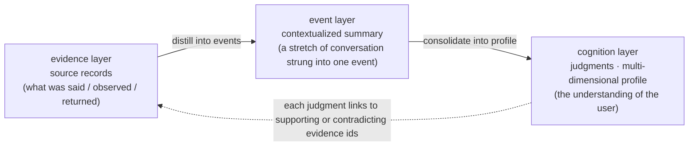
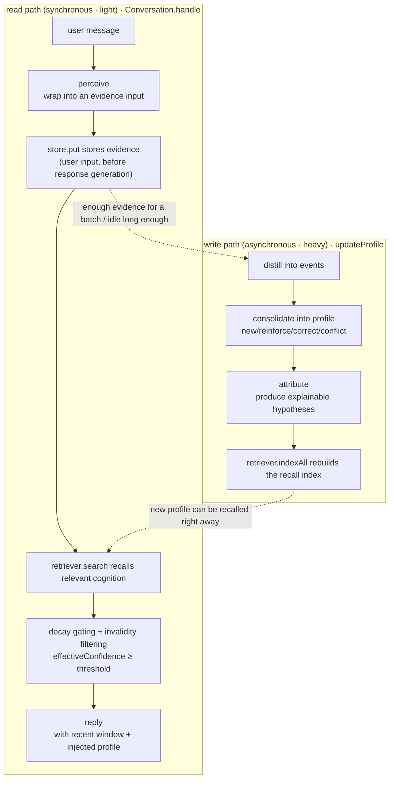
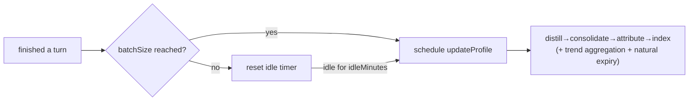
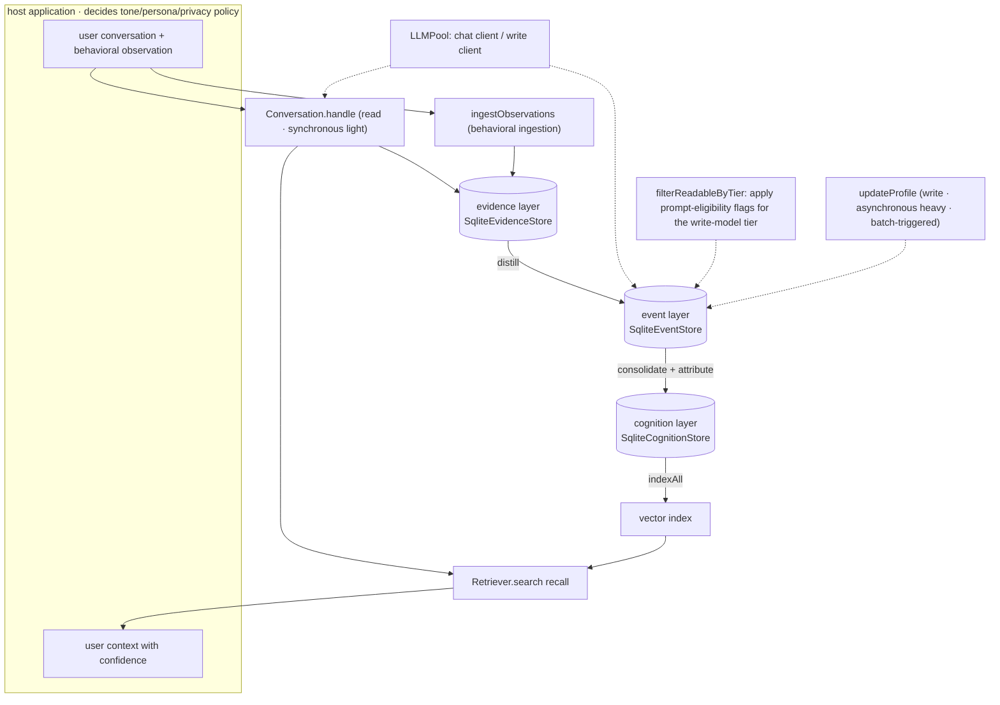

# MemoWeft Architecture Overview

> This public architecture guide connects MemoWeft's three-layer data model, read and write paths, and evidence-handling rules to the implementation.
> For host integration, see [integration.md](../integration.md). For the stability boundary, see [memory-surface-contract.md](../reference/memory-surface-contract.md). The confidence, conflict, and prompt-eligibility mechanisms are implemented in `src/consolidation/confidence.ts`, `src/consolidation/consolidate.ts`, and `src/evidence/privacy.ts`.

MemoWeft combines **Memo** with **Weft**, the crosswise thread in a weave: the library connects individual source records into a traceable, revisable model of a user.

---

## 1. What it is / is not

MemoWeft is a TypeScript library for durable user memory and context. It runs **outside** the LLM or agent and is imported by a host application.

- **What it does**: accepts conversation, observation, and tool-result records under host-controlled authorization; derives model-independent, traceable, revisable, and portable memory; and returns user context with explicit confidence and provenance.
- **What it does not do**: it does not provide chat UI, a persona, authentication, or a complete privacy policy. The **host and user** decide tone, proactive questions, model location, and which data may leave the host. MemoWeft exposes explicit configuration and replaceable interfaces for those decisions.

In one line: **MemoWeft maintains structured user memory; the host decides how and where to use it.**

### 1.1 Three-layer boundary (Core / Host / Plugin)

MemoWeft separates Core memory processing, host application responsibilities, and optional plugin capabilities. The built-in Core APIs and `PluginContext` define the extension surface; hosts remain responsible for their security and operational controls.
For the responsibilities and scope of this boundary, see [Boundaries](./boundaries.md); for plugin permissions and the hook contract see [plugin-contract.md](../plugin-contract.md).

---

## 2. The three-layer data model

MemoWeft separates information about a user into three layers. Each derived layer remains traceable to its **source records**:



The layer boundary is deliberate: **records are not beliefs, and evidence is not verified truth**. Evidence stores what was said, observed, or returned; cognition stores derived judgments about the user. Every derived judgment can link back to the records that support or contradict it.

### 2.1 evidence (evidence layer) — source records

Code: `src/evidence/model.ts`, `src/evidence/store.ts`

Stores **source material**, not judgments. Confidence, credibility status, and scope belong to cognition rather than evidence. Evidence fields describe a record and its provenance; they do not certify its content as true.

| Field                | Type                                             | Meaning                                                                                |
| -------------------- | ------------------------------------------------ | -------------------------------------------------------------------------------------- |
| `id`                 | string                                           | Primary key (`randomUUID`)                                                             |
| `subjectId`          | string                                           | Which user's evidence                                                                  |
| `sourceKind`         | `'spoken' \| 'inferred' \| 'observed' \| 'tool'` | Provenance category: user speech, inferred input, observation, or external tool result |
| `hostId`             | string                                           | Which host it came from                                                                |
| `originId`           | string \| null                                   | Original message id, **idempotent de-duplication**; has a unique index                 |
| `occurredAt`         | string(ISO)                                      | When the recorded event occurred                                                       |
| `recordedAt`         | string(ISO)                                      | When MemoWeft **received and stored** it                                               |
| `rawContent`         | string                                           | Original user text, observation, or tool result                                        |
| `summary`            | string                                           | Summary for recall; v1 = `rawContent`                                                  |
| `allowLocalRead`     | boolean                                          | Whether MemoWeft's built-in local write-model prompt may include it                    |
| `allowCloudRead`     | boolean                                          | Whether MemoWeft's built-in cloud write-model prompt may include it                    |
| `allowInference`     | boolean                                          | Whether the profile/motive may be inferred from it                                     |
| `correctsEvidenceId` | string \| null                                   | If correcting an old record, points to the old evidence                                |

MemoWeft keeps two time anchors: `occurredAt` records when something happened, while `recordedAt` records when MemoWeft stored it. A statement about an event last night may be recorded today; retaining both timestamps preserves that distinction during later processing.

### 2.2 event (event layer) — contextualized summary

Code: `src/event/model.ts`, `src/event/store.ts`

An event is a contextualized summary of a group of source records. The `event_evidence` relation links it to the evidence it covers. Cognition is derived from these contextualized events, while provenance still resolves to the original evidence.

- `Event`: `id / subjectId / summary / occurredAt / createdAt`; `occurredAt` = the earliest occurred time among the covered evidence.
- Storage includes a `consolidated` flag that identifies events already processed into cognition, enabling incremental updates.
- **Built-in ingestion boundary**: event summaries built from Core's built-in ingestion use user, observation, and tool source records; assistant replies are not persisted as evidence. See [no self-evidence](../concepts/no-self-evidence.md).

### 2.3 cognition (cognition layer) — judgments · multi-dimensional profile

Code: `src/cognition/model.ts`, `src/cognition/store.ts`

A `Cognition` represents one derived judgment about the user; a collection of cognitions forms the profile. Prompt-eligibility flags remain on evidence rather than cognition.

| Field                 | Type                                                                             | Meaning                                                                                                               |
| --------------------- | -------------------------------------------------------------------------------- | --------------------------------------------------------------------------------------------------------------------- |
| `contentType`         | `fact \| preference \| goal \| project \| state \| trait \| hypothesis \| trend` | One primary content type                                                                                              |
| `formedBy`            | `stated \| observed \| ruled \| confirmed \| inferred`                           | Provenance classification used by the scoring rules; `confirmed` is a user affirmation of an assistant-proposed claim |
| `confidence`          | number(0~1000)                                                                   | Deterministic heuristic score, **computed by MemoWeft, not self-reported by the LLM or a calibrated probability**     |
| `credStatus`          | `candidate \| low \| limited \| stable \| conflicted`                            | Credibility status                                                                                                    |
| `scope`               | string \| null                                                                   | Applicable scenario; null = general                                                                                   |
| `validAt / invalidAt` | string \| null                                                                   | Take-effect / expire time anchor; **mark as invalid rather than delete** (kept traceable)                             |
| `askedAt`             | string \| null                                                                   | Timestamp of proactive asking; used for "already asked, don't ask again" de-duplication                               |
| `archivedAt`          | string \| null                                                                   | Archive timestamp; non-null = archived (skipped by recall, data kept and recoverable)                                 |

The `cognition_evidence` relation records which evidence items `support` or `contradict` each cognition. This relation provides the concrete provenance link from a judgment back to source records.

Two special types are worth calling out on their own:

- `hypothesis`: an explainable, evidence-linked inference about why something may have happened. It remains low-confidence and can be contradicted or replaced.
- `trend`: a cross-session pattern aggregated from recurring states after rule-based frequency screening (`formedBy=ruled`). It decays over time and is distinct from a stable trait.

---

## 3. Read/write dual paths (read/write decoupling)

MemoWeft keeps the read path synchronous and lightweight, while the write path is designed for host-scheduled background batches. A conversation turn stores evidence and retrieves relevant cognition; profile derivation runs separately through `updateProfile` and does not need to block the reply path.



### 3.1 Read path (`src/pipeline/conversation.ts`)

`Conversation.handle(userMsg)` does three things per turn:

1. **Perceive → store evidence**: Core's built-in conversation path wraps the user message in an `EvidenceInput` (default `spoken`) and stores it. This path does not persist assistant replies as evidence. The write is attempted before response generation, so a model failure does not discard the user's input.
2. **Recall relevant cognition**: `retriever.search(userMsg, topK)` finds the top-k relevant cognitions. If it fails, the path treats the result as no recall for that turn. The recall results still pass through two gates:
   - Invalidity filtering: those with a non-empty `invalidAt` (corrected/expired) are not injected, even if the index has not been rebuilt yet.
   - **Decay gating**: confidence uses **effective confidence** `effectiveConfidence` (see [typed decay](../concepts/decay.md)); those below `minEffectiveConfidence` (faded emotions, stale hypotheses) are not injected.
3. **Reply**: `reply` combines the recent in-memory turn window (`WorkingMemory`) with recalled cognition and calls the conversation model. The injected context includes confidence guidance so low-confidence cognition is not presented as established fact.

> The read path does not write the profile; it reads cognition and stores source records. Digesting conversation into a profile is the write path's job.

### 3.2 Write path (`src/consolidation/updateProfile.ts`)

Core exposes `updateProfile` as a single orchestration entry point: `distill → consolidate → attribute → indexAll`. The result records per-step elapsed time in `timings`. An index-rebuild failure **does not roll back profile changes** because the index is a derived read-path optimization.

The four steps are detailed below.

---

## 4. The four write-path steps + cognitive discipline

The write path applies explicit rules intended to keep derived memory traceable and appropriately qualified. These rules span every processing step.

### 4.1 Records are not beliefs (what the LLM infers starts as a low-confidence candidate)

Implementation: `src/consolidation/confidence.ts`

**MemoWeft computes confidence from deterministic, configurable rules; it does not accept a score reported by the LLM.** The result is a heuristic score, not a calibrated probability. `computeConfidence` uses parameters from `config.ts`:

```
confidence = base score (by formedBy) + supporting-evidence bonus (capped) − opposing-evidence penalty
```

- **Base score by `formedBy`** (`baseByFormedBy`): `stated:600`, `ruled:450`, `observed:350`, `confirmed:280`, and `inferred:200` in the default configuration. `formedBy` is derived from supporting evidence and consolidation rules; it is separate from `Evidence.sourceKind`. A `confirmed` claim is a user affirmation of an assistant-proposed proposition.
- Each additional supporting evidence `+supportStep(40)`, up to `supportCap(5)` pieces; each opposing evidence `−contradictPenalty(120)`.
- The result is clamped to `[minConfidence(50), 1000]`, always > 0.
- `deriveCredStatus` maps the score to `candidate/low/limited/stable` by threshold; any opposing evidence directly makes it `conflicted`.

**Step one, distill** (`src/distillation/distill.ts`): selects eligible evidence not yet assigned to an event, orders it by occurrence time, and asks the write model for a contextualized event summary.

### 4.2 No self-corroboration (the assistant's output / the user's silence is not evidence)

Implementation: the prompts and data flow in distill, consolidate, and attribute.

- Core's **built-in ingestion** stores user messages as evidence; its assistant replies are not persisted as evidence (`conversation.ts` and `recordAssistantReply` keep them outside the evidence store).
- The distill prompt excludes assistant text and speculative commentary from event summaries.
- In consolidate and attribute, support ids must belong to the evidence allowlist supplied with the prompt. Unknown ids are discarded, and a candidate without valid supporting evidence is not stored.
- Asking (`proposeAsk`) itself does not enter evidence; only the user's **answer** is new evidence.

### 4.3 Conflicts are exposed first, never auto-resolved

Implementation: `src/consolidation/consolidate.ts`

**Step two, consolidate**: supplies new, unconsolidated events and the existing profile to the write model, then validates and applies four operation types:

| Operation   | Meaning                                                                             | Handling                                                                                   |
| ----------- | ----------------------------------------------------------------------------------- | ------------------------------------------------------------------------------------------ |
| `new`       | Present in the new material, absent from the profile                                | Add a new cognition (must have traceable original words, otherwise skip)                   |
| `reinforce` | New original words corroborate an existing cognition                                | Attach evidence, recompute confidence upward                                               |
| `correct`   | The user **explicitly corrects/negates** a cognition                                | Mark the earlier cognition `invalidAt`, retain it for provenance, and adopt the correction |
| `conflict`  | Contradictory but **not an explicit correction** (e.g. behavior vs. old preference) | Mark `conflicted`, **keep both, attach contradict evidence, do not replace**               |

The key distinction is user intent. `correct` represents an explicit clarification and invalidates the earlier cognition. `conflict` records contradictory material without choosing a winner. The `conflicted` status and contradictory evidence links implement the policy that conflicts remain visible until resolved explicitly.

### 4.4 Per-type time strategy (short-lived states fade sooner)

Implementation: `src/background/decay.ts` (decay), `src/background/expire.ts` (expiry), and `confidence.ts` (transient-type cap).

Time handling depends on cognition type; age alone is not treated as a universal measure of reliability:

- **Transient-type cap** (`confidence.ts`): `transientTypes` (for example, `state`) are capped at `transientCap(300)` and never receive `stable` or `limited` status from `deriveCredStatus`. Repetition therefore does not turn a transient state into a stable trait.
- **Decay at read time** (`decay.ts`): effective confidence = `confidence × 2^(−age/half-life)`, computed by the distance from the last corroboration `updatedAt`. **Computed at read time, not persisted** (the stored `confidence` remains the rule-based score). The default half-lives (days) are `state:1.5 / hypothesis:2 / goal,project:14 / trend:7 / trait:60`; `fact` and `preference` are omitted from the default map, so they do not decay under the default configuration. Hosts can configure other values.
- **Natural expiry** (`expire.ts`): types listed in `expireAfterDays` are marked `invalidAt` after the configured interval (defaults: `state:7 / hypothesis:14 / trend:30`). Types omitted from that default map do not automatically expire under the default configuration. Invalidation = a mark kept traceable, not a delete.

### 4.5 Attribution — explainable, low-confidence hypotheses

**Step three, attribute** (`src/attribution/attribute.ts`): for a recurring `state`, it gathers eligible evidence from the configured time window and asks the model for a possible explanation. The result is stored as an **explainable hypothesis** only after validation:

- Hypotheses use `formedBy=inferred` and are capped at `hypothesisCap(250)`, keeping them below the confidence of established cognition.
- Attribution considers only **recurring** phenomena (support ≥ `minPhenomenonSupport`) and processes at most `maxPhenomenaPerRun(1)` per run by default.
- A cause must be backed by behavior or observation evidence. Another `state` cannot serve as cause evidence for the phenomenon.
- A single hypothesis attaches at most `maxCausesPerHypothesis(2)` cause-evidence pieces; ids fabricated by the LLM are all discarded (no self-corroboration).

---

## 5. Recall

Code: `src/retrieval/`

The recall foundation is a **replaceable seam** (the `Retriever` interface), with two methods: `indexAll` (replacement-style index rebuild) + `search` (top-k). Two implementations:

- When no embedder is configured, recall falls back to `KeywordRetriever` (local FTS5 keyword search); `NullRetriever` (an empty implementation whose `search` returns `[]`) is the last-resort fallback only when FTS5 is unavailable. Neither errors the reply.
- `VectorRetriever`: SQLite stores vectors and JavaScript computes cosine similarity, without a native vector extension such as sqlite-vec. This design targets modest per-subject collections; benchmark representative data before choosing it for larger workloads. `indexAll` rebuilds by replacement, while `search` embeds the query and computes top-k similarity.

`Embedder` is likewise replaceable (`OpenAICompatEmbedder` calls the OpenAI-compatible `/embeddings`); when configuration is missing, `loadEmbedConfig` returns `null` and Core uses the FTS5 fallback above (or `NullRetriever` if FTS5 is unavailable).

**The index is rebuilt by the write path**: `updateProfile`'s final step `indexAll` only indexes **non-invalidated** cognitions (corrected/expired ones are no longer recalled). The read path only does `search`, so a newly updated profile can be recalled right after the update completes.

---

## 6. Host-scheduled profile updates

The write path may require several model calls, so hosts should schedule it outside the latency-sensitive reply path. Conversation turns store evidence immediately; the host can run profile updates after a batch threshold or idle interval.

- Library side: `config.profileUpdate` supplies strategy parameters (defaults: `batchSize: 12`, `idleMinutes: 30`) and Core exposes `updateProfile` as the execution entry point.
- **Trigger scheduling belongs to the host**: the library does not run a timer, choose a queue, or serialize jobs. A host may use the supplied values as one batching policy (for example, queue after enough new conversations or after an idle interval), and should provide its own per-subject concurrency control where needed.



The reference scheduling flow can also run `aggregateTrends` (cross-session aggregation after rule-based frequency screening) and `expire` (invalidation of transient cognition after configured intervals).

---

## 7. Switchable parts (model seam, embedding seam, recall seam)

MemoWeft places model, embedding, and retrieval dependencies behind replaceable interfaces:

### 7.1 llmPool — switch models by purpose

Code: `src/llm/pool.ts`, `src/llm/client.ts`

Conversation generation and background profile updates have different latency and cost requirements. `LLMPool` selects clients by **purpose**:

- `pool.for('chat')`: the conversation model, configured through `MEMOWEFT_LLM_*`.
- `pool.for('write')`: the write-path model, configured through `MEMOWEFT_WRITE_LLM_*`; if it is not configured, MemoWeft falls back to the chat client.

`LLMClient` defines `chat(messages)` and usage counters. `OpenAICompatClient` uses the built-in `fetch` API to call an OpenAI-compatible `/chat/completions` endpoint without requiring a provider SDK.

### 7.2 Dual-prefix env compatibility (conservative renaming)

Code: `readEnvWithFallback` in `client.ts` + `embedder.ts`

Environment loading supports both prefixes: each `MEMOWEFT_*` key is checked first, followed by its legacy `DLA_*` equivalent. Existing environments that use only the legacy prefix remain compatible. The mapping applies to the LLM, write-model, and embedding `BASE_URL`, `API_KEY`, and `MODEL` variables.

---

## 8. Privacy / authorization bits (allowCloudRead)

Code: `src/evidence/privacy.ts`, `src/perception/ingest.ts`

Cloud and local processing choices belong to the host and user. These flags control evidence eligibility for MemoWeft's built-in write-model prompts; they are **not** authentication, access control, encryption, or a general data-security boundary.

- **Three flags live on evidence**: `allowLocalRead` controls eligibility for built-in local write-model prompts, `allowCloudRead` controls eligibility for built-in cloud write-model prompts, and `allowInference` controls eligibility for profile derivation. These flags do not restrict recall or list APIs, MCP tools, adapters, custom host code, derived cognition, exports, or logs. Hosts remain responsible for storage, transport, access control, and every path outside the built-in write-model prompts.
- **Write-path filtering**: `filterReadableByTier(items, tier)` applies `allowCloudRead` for a cloud write model and `allowLocalRead` for a local write model. Distill, consolidate, and attribute also apply `allowInference`. Evidence blocked by either gate is excluded from both the model prompt and the valid support-id set.
- **Default configuration**: for source kinds that use `evidenceDefaults`, the cloud default follows `privacyMode`; privacy mode makes them ineligible for built-in cloud write-model prompts by default.
- **Observation defaults**: `observedDefaults = { local:true, cloud:false, inference:true }`. Unless explicitly overridden at the Core API, observed evidence is eligible for local processing and inference but not for built-in cloud write-model prompts.
- **Tool-result defaults**: `toolDefaults = { local:true, cloud:false, inference:true }`. Tool output receives the same conservative cloud default because it can contain sensitive web, file, or API data. `store.put` applies these defaults according to `sourceKind` as a final safeguard.
- **Write-model tier**: the active `LLMClient` carries its tier. `MEMOWEFT_WRITE_LLM_TIER` configures a dedicated write client (default `cloud`); when the write pool falls back to the chat client, it inherits that client's tier.

---

## 9. Behavioral perception ingestion (multi-source evidence entry)

Code: `src/perception/ingest.ts` defines the Core ingestion entry; operating-system collection belongs to the independent plugin package `plugins/collector-active-window/`.

In addition to conversation input, `ingestObservations` accepts normalized `Observation` objects (`kind`, `occurredAt`, `content`, and optional authorization flags). It stores them as `sourceKind='observed'` evidence and uses `originId` for idempotent deduplication.

**Boundary**: Core defines the observation input and authorization contract but does not collect operating-system data. Active-window sampling and scheduling live in the separate `@memoweft/collector-active-window` plugin. The reference host receives observations through `/api/observe`, validates them, and calls `core.ingestObservation`; the plugin does not bypass Core's public API. See [the three-layer boundary](./boundaries.md) for details.

---

## 10. Storage and observability

- **Storage**: each layer uses a `Sqlite*Store` behind the driver interface in `src/store/driver.ts`. Node ≥24 defaults to built-in `node:sqlite`; environments without it may use optional `better-sqlite3` (required for the Node 20/22 compatibility path). The default database remains `./dla.db` for compatibility with existing installations. Tests use `':memory:'`, and schema migrations are idempotent.
- **Observability**: `RunLogger` in `src/obs/runLog.ts` can persist conversation turns and profile-update timings for diagnostics.

---

## 11. One diagram overview


