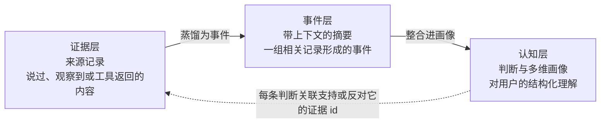
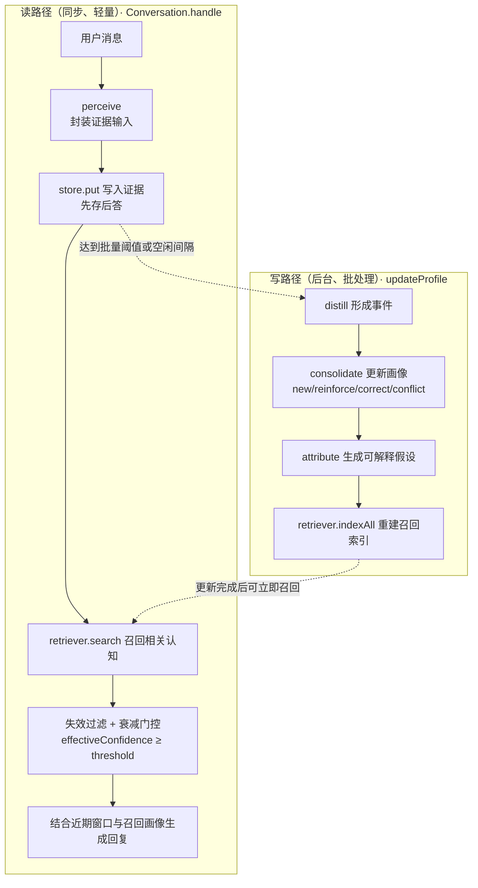
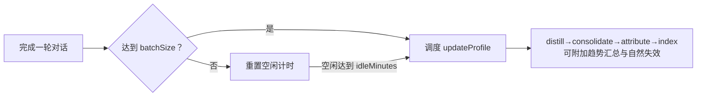
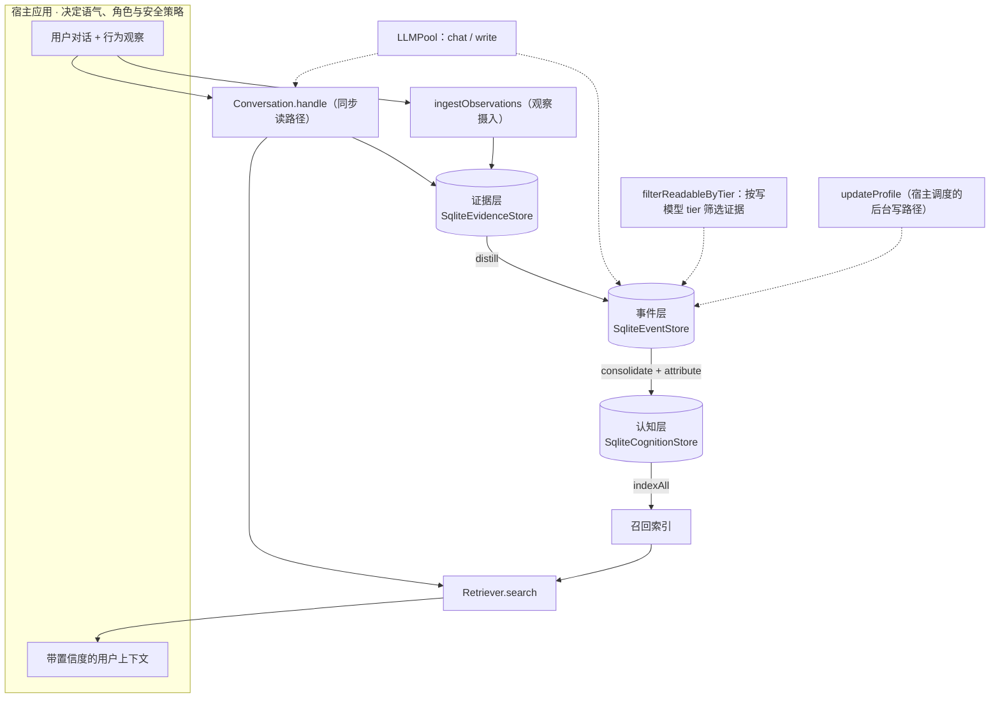

# MemoWeft 架构概览

> 本文从三层数据模型、读写路径与证据处理规则出发，说明 MemoWeft 的公开架构，并标出对应实现。
> 宿主接入见 [integration.zh-CN.md](../integration.zh-CN.md)，稳定性边界见 [memory-surface-contract.zh-CN.md](../reference/memory-surface-contract.zh-CN.md)。置信度、冲突处理与提示词证据筛选分别实现在 `src/consolidation/confidence.ts`、`src/consolidation/consolidate.ts` 与 `src/evidence/privacy.ts`。

MemoWeft 由 **Memo** 与 **Weft**（织物中的纬线）组成：它把分散的来源记录连接成一份可追溯、可修订的用户记忆。

---

## 1. 它是什么，以及不是什么

MemoWeft 是一个用于持久用户记忆与上下文的 TypeScript 库。它运行在大模型或 Agent **外部**，由宿主应用引入。

- **它负责**：在宿主控制的授权边界内接收对话、观察与工具结果；生成独立于具体模型、可追溯、可修订、可迁移的记忆；按需返回带置信度与来源信息的用户上下文。
- **它不负责**：聊天界面、角色设定、身份认证或完整隐私策略。语气、主动询问、模型运行位置，以及哪些数据可以离开宿主，都由**宿主与用户**决定。MemoWeft 为这些选择提供显式配置和可替换接口。

一句话：**MemoWeft 维护结构化用户记忆，宿主决定如何以及在哪里使用它。**

### 1.1 Core / Host / Plugin 边界

MemoWeft 把核心记忆处理、宿主应用责任和可选插件能力分开。Core 的公开 API 与 `PluginContext` 构成扩展边界；安全控制和运行策略仍由宿主负责。

边界的职责与范围见 [boundaries.zh-CN.md](./boundaries.zh-CN.md)，插件权限和 hook 契约见 [plugin-contract.zh-CN.md](../plugin-contract.zh-CN.md)。

---

## 2. 三层数据模型

MemoWeft 把用户信息分为三层。每一层的派生结果都能追溯到**来源记录**：



三层边界是明确的：**记录不等于信念，证据也不等于已经核实的事实**。证据保存说过、观察到或返回的内容；认知保存由这些记录派生的判断。每条判断都可以关联回支持或反对它的来源记录。

### 2.1 evidence（证据层）——来源记录

代码：`src/evidence/model.ts`、`src/evidence/store.ts`

证据层只保存**来源材料**，不保存判断。置信度、可信状态和适用范围属于认知层。证据字段描述记录及其来源，不证明内容本身为真。

| 字段                 | 类型                                             | 含义                                                   |
| -------------------- | ------------------------------------------------ | ------------------------------------------------------ |
| `id`                 | string                                           | 主键（`randomUUID`）                                   |
| `subjectId`          | string                                           | 证据所属用户                                           |
| `sourceKind`         | `'spoken' \| 'inferred' \| 'observed' \| 'tool'` | 来源类别：用户表达、推断型输入、行为观察或外部工具结果 |
| `hostId`             | string                                           | 记录来自哪个宿主                                       |
| `originId`           | string \| null                                   | 来源消息 id；唯一索引用于幂等去重                      |
| `occurredAt`         | string（ISO）                                    | 内容所描述事件的发生时间                               |
| `recordedAt`         | string（ISO）                                    | MemoWeft 接收并写入记录的时间                          |
| `rawContent`         | string                                           | 原始用户文本、观察内容或工具结果                       |
| `summary`            | string                                           | 用于召回的摘要；当前版本等于 `rawContent`              |
| `allowLocalRead`     | boolean                                          | 是否可进入 MemoWeft 内建的本地写模型提示词             |
| `allowCloudRead`     | boolean                                          | 是否可进入 MemoWeft 内建的云端写模型提示词             |
| `allowInference`     | boolean                                          | 是否可用于画像推导                                     |
| `correctsEvidenceId` | string \| null                                   | 若当前记录用于纠正旧记录，则指向旧证据                 |

MemoWeft 同时保留两个时间锚：`occurredAt` 表示事情何时发生，`recordedAt` 表示何时被系统写入。一件昨晚发生的事可能今天才被记录；保留两者可让后续处理区分事件时间和入库时间。

`sourceKind` 只表示来源类别，不表示强度顺序。认知的置信度由 `formedBy`、配置参数、支持证据数量、反对证据数量以及类型规则计算。

### 2.2 event（事件层）——带上下文的摘要

代码：`src/event/model.ts`、`src/event/store.ts`

事件是一组来源记录的上下文化摘要。`event_evidence` 关系把事件连接到它覆盖的证据。认知从这些带上下文的事件派生，但来源追溯最终仍落到原始证据。

- `Event` 包含 `id / subjectId / summary / occurredAt / createdAt`；`occurredAt` 取所覆盖证据中最早的发生时间。
- 存储层的 `consolidated` 标记表示事件是否已经处理进认知层，用于增量更新。
- Core 内建摄入产生的事件摘要可使用用户消息、观察和工具结果；助手回复不会作为证据持久化。详见 [不把系统自身输出当证据](../concepts/no-self-evidence.zh-CN.md)。

### 2.3 cognition（认知层）——判断与多维画像

代码：`src/cognition/model.ts`、`src/cognition/store.ts`

一条 `Cognition` 表示一个派生判断，多条认知共同组成画像。提示词证据筛选标志保留在证据层，不复制到认知层。

| 字段                  | 类型                                                                             | 含义                                                                 |
| --------------------- | -------------------------------------------------------------------------------- | -------------------------------------------------------------------- |
| `contentType`         | `fact \| preference \| goal \| project \| state \| trait \| hypothesis \| trend` | 主内容类型                                                           |
| `formedBy`            | `stated \| observed \| ruled \| confirmed \| inferred`                           | 供置信度规则使用的形成方式；`confirmed` 表示用户确认了助手提出的命题 |
| `confidence`          | number（0~1000）                                                                 | MemoWeft 计算的确定性启发式分数，不是模型自报值或校准概率            |
| `credStatus`          | `candidate \| low \| limited \| stable \| conflicted`                            | 可信状态                                                             |
| `scope`               | string \| null                                                                   | 适用场景；null 表示通用                                              |
| `validAt / invalidAt` | string \| null                                                                   | 生效和失效时间锚；失效采用标记而非删除                               |
| `askedAt`             | string \| null                                                                   | 主动询问时间，用于避免重复询问                                       |
| `archivedAt`          | string \| null                                                                   | 归档时间；归档项不参与召回，但数据保留且可恢复                       |

`cognition_evidence` 关系记录每条认知由哪些证据 `support` 或 `contradict`。它提供了判断回到来源记录的具体追溯链。

两个特殊类型需要单独说明：

- `hypothesis`：关于原因的可解释推断，必须关联证据，维持低置信，并允许被反驳或替换。
- `trend`：从跨会话重复状态中汇总出的模式。它通过频次规则筛选后形成（`formedBy=ruled`），会随时间衰减，并不等同于稳定特质。

---

## 3. 读写双路径

MemoWeft 让读路径保持同步、轻量，把写路径设计成由宿主调度的后台批处理。对话轮次负责写入证据和召回相关认知；画像派生通过独立的 `updateProfile` 执行，无需阻塞回复路径。



### 3.1 读路径（`src/pipeline/conversation.ts`）

`Conversation.handle(userMsg)` 每轮执行三件事：

1. **感知并写入证据**：内建对话路径把用户消息封装成 `EvidenceInput`（默认 `spoken`）并写入。助手回复不会作为证据持久化。证据写入在生成回复前尝试，因此模型调用失败不会丢掉用户输入。
2. **召回相关认知**：`retriever.search(userMsg, topK)` 返回相关认知。召回失败时，该次请求按无召回结果继续。结果还会经过失效过滤和有效置信度门控：`invalidAt` 非空的项不注入，低于 `minEffectiveConfidence` 的项也不注入。
3. **生成回复**：`reply` 组合近期内存窗口（`WorkingMemory`）和召回认知，再调用对话模型。注入上下文包含置信度提示，避免把低置信认知表述成确定事实。

> 读路径读取认知并保存来源记录，但不更新画像；把对话材料整理进画像属于写路径。

### 3.2 写路径（`src/consolidation/updateProfile.ts`）

Core 通过单一入口 `updateProfile` 编排 `distill → consolidate → attribute → indexAll`。返回值在 `timings` 中记录各步骤耗时。索引重建失败不会回滚画像变更，因为索引是可重建的读路径派生数据。

---

## 4. 写路径规则

写路径使用明确规则，使派生记忆保持可追溯并带有适当限定。

### 4.1 记录不等于信念

实现：`src/consolidation/confidence.ts`

**MemoWeft 使用确定、可配置的规则计算置信度，不采用 LLM 自报分数。** 结果是启发式分数，不是校准概率：

```text
confidence = formedBy 基础分 + 支持证据加分（封顶）− 反对证据扣分
```

- 默认 `baseByFormedBy` 为 `stated:600`、`ruled:450`、`observed:350`、`confirmed:280`、`inferred:200`。
- `formedBy` 由支持证据和整合规则派生，与 `Evidence.sourceKind` 是不同概念。
- 每条额外支持证据增加 `supportStep(40)`，最多计 `supportCap(5)` 条；每条反对证据扣除 `contradictPenalty(120)`。
- 分数被限制在 `[minConfidence(50), 1000]`；`deriveCredStatus` 根据阈值映射到 `candidate/low/limited/stable`，存在反对证据时为 `conflicted`。

第一步 `distill`（`src/distillation/distill.ts`）选择尚未归入事件且满足处理条件的证据，按发生时间排序，并让写模型生成带上下文的事件摘要。

### 4.2 不把系统自身输出当证据

实现：distill、consolidate 和 attribute 的提示词与数据流。

- Core 的内建摄入把用户消息写成证据；助手回复不进入证据表。
- distill 提示词排除助手文本与推测性评价。
- consolidate 和 attribute 只接受提示词所附证据允许列表中的支持 id。未知 id 会被丢弃，没有有效支持证据的候选不会写入。
- `proposeAsk` 产生的问题本身不进入证据；只有用户回答才是新证据。

### 4.3 冲突先暴露，不自动裁决

实现：`src/consolidation/consolidate.ts`

第二步 `consolidate` 把尚未整合的事件和现有画像交给写模型，再验证并执行四类操作：

| 操作        | 含义                             | 处理方式                                         |
| ----------- | -------------------------------- | ------------------------------------------------ |
| `new`       | 新材料中出现、画像中尚不存在     | 新增认知；必须有可追溯证据                       |
| `reinforce` | 新证据支持现有认知               | 关联证据并重新计算置信度                         |
| `correct`   | 用户明确纠正或否定现有认知       | 给旧认知标记 `invalidAt`，保留追溯链并采用新认知 |
| `conflict`  | 材料矛盾，但用户没有明确作出纠正 | 标记 `conflicted`，保留双方并关联反对证据        |

`correct` 表示用户主动澄清，因此旧认知失效；`conflict` 只记录矛盾，不替用户选择结论。`conflicted` 状态与反对证据关系共同实现这一策略。

### 4.4 按类型处理时间

实现：`src/background/decay.ts`、`src/background/expire.ts`、`src/consolidation/confidence.ts`

时间策略取决于认知类型，不能仅凭年龄统一降低可信度：

- **临时类型封顶**：`transientTypes`（默认包括 `state`）的分数不超过 `transientCap(300)`，且不会被 `deriveCredStatus` 标为 `stable` 或 `limited`。
- **读时衰减**：有效置信度为 `confidence × 2^(−age/half-life)`，以 `updatedAt` 为时间锚，在读取时计算而不持久化。默认半衰期（天）为 `state:1.5 / hypothesis:2 / goal,project:14 / trend:7 / trait:60`；默认未配置 `fact` 和 `preference`，因此它们不衰减。
- **自然失效**：`expireAfterDays` 中配置的类型超过时限后标记 `invalidAt`（默认 `state:7 / hypothesis:14 / trend:30`）。未列出的类型默认不会自动失效。失效是可追溯标记，不是删除。

### 4.5 归因：可解释的低置信假设

第三步 `attribute`（`src/attribution/attribute.ts`）针对重复出现的 `state`，收集配置时间窗口内符合条件的证据，并请求模型提出可能原因。结果通过验证后才作为假设写入：

- 假设使用 `formedBy=inferred`，并受 `hypothesisCap(250)` 限制，保持低于已确立认知的置信度。
- 只有支持数达到 `minPhenomenonSupport` 的重复现象才参与归因；默认每次最多处理 `maxPhenomenaPerRun(1)` 个现象。
- 原因必须由行为或观察证据支持，另一个 `state` 不能作为该现象的原因证据。
- 每个假设最多关联 `maxCausesPerHypothesis(2)` 条原因证据；模型生成的未知 id 会被丢弃。

---

## 5. 召回

代码：`src/retrieval/`

召回能力位于可替换的 `Retriever` 接口之后，包含 `indexAll`（替换式重建索引）与 `search`（top-k 搜索）：

- 未配置嵌入器时，Core 使用本地 FTS5 的 `KeywordRetriever`；只有 FTS5 不可用时才退化为返回空结果的 `NullRetriever`。两种降级都不会中断回复。
- `VectorRetriever` 在 SQLite 中保存向量，并用 JavaScript 计算余弦相似度，不依赖 sqlite-vec 一类原生向量扩展。该设计面向规模适中的单 subject 数据集；更大负载应先用代表性数据做基准测试。`indexAll` 替换式重建索引，`search` 嵌入查询后计算 top-k。

`Embedder` 同样可替换。`OpenAICompatEmbedder` 调用兼容 OpenAI 的 `/embeddings`；缺少配置时，`loadEmbedConfig` 返回 `null`，Core 使用上述关键词降级路径。

写路径的最后一步重建索引，只索引未失效的认知。读路径只执行 `search`，因此画像更新完成后即可召回新结果。

---

## 6. 宿主调度的画像更新

写路径可能包含多次模型调用，宿主应把它安排在对延迟不敏感的路径上。对话轮次立即记录证据；宿主可在达到批量阈值或空闲间隔后运行画像更新。

- `config.profileUpdate` 提供参考参数，默认 `batchSize: 12`、`idleMinutes: 30`；Core 提供单次执行入口 `updateProfile`。
- **触发与调度由宿主负责**：库本身不启动计时器、不选择队列，也不负责作业串行化。需要时，宿主应实现按 subject 的并发控制。



参考调度流程还可以运行 `aggregateTrends`（通过频次规则筛选后的跨会话趋势汇总）和 `expire`（按配置时限使临时认知失效）。

---

## 7. 可替换依赖

MemoWeft 把模型、嵌入与召回能力放在可替换接口之后。

### 7.1 `LLMPool`：按用途选择模型

代码：`src/llm/pool.ts`、`src/llm/client.ts`

对话生成与后台画像更新具有不同的延迟和成本要求。`LLMPool` 按用途选择客户端：

- `pool.for('chat')`：对话模型，通过 `MEMOWEFT_LLM_*` 配置。
- `pool.for('write')`：写路径模型，通过 `MEMOWEFT_WRITE_LLM_*` 配置；未配置时回退到 chat 客户端。

`LLMClient` 定义 `chat(messages)` 与用量计数。`OpenAICompatClient` 使用内建 `fetch` 调用兼容 OpenAI 的 `/chat/completions`，不要求安装供应商 SDK。

### 7.2 环境变量前缀兼容

代码：`client.ts` 与 `embedder.ts` 中的 `readEnvWithFallback`

环境变量读取同时支持新旧前缀：先读取 `MEMOWEFT_*`，未设置时再读取对应的 `DLA_*`。现有环境如果仍使用旧前缀，可以继续工作。该映射覆盖 LLM、写模型与嵌入模型的 `BASE_URL`、`API_KEY` 和 `MODEL`。

---

## 8. 提示词证据筛选标志

代码：`src/evidence/privacy.ts`、`src/perception/ingest.ts`

云端或本地处理由宿主和用户决定。这些标志只控制 MemoWeft **内建写模型提示词**的证据资格；它们不是身份认证、访问控制、加密或通用数据安全边界。

- `allowLocalRead` 控制内建本地写模型提示词资格，`allowCloudRead` 控制内建云端写模型提示词资格，`allowInference` 控制画像推导资格。这些标志不会限制 recall/list API、MCP 工具、适配器、自定义宿主代码、派生认知、导出或日志。宿主仍需负责存储、传输、访问控制，以及内建写模型提示词之外的所有数据路径。
- `filterReadableByTier(items, tier)` 针对 cloud 使用 `allowCloudRead`，针对 local 使用 `allowLocalRead`。distill、consolidate 与 attribute 还会应用 `allowInference`。被任一门控排除的证据既不会进入提示词，也不会进入有效支持 id 集合。
- 对使用 `evidenceDefaults` 的来源，云端默认值跟随 `privacyMode`；开启隐私模式后，默认不能进入内建云端写模型提示词。
- `observedDefaults = { local:true, cloud:false, inference:true }`：除非 Core API 调用显式覆盖，观察证据默认可用于本地处理与推导，但不可进入内建云端写模型提示词。
- `toolDefaults = { local:true, cloud:false, inference:true }`：工具输出采用同样保守的云端默认值，因为网页、文件或 API 结果可能包含敏感数据。`store.put` 会按 `sourceKind` 应用这些默认值。
- 活跃 `LLMClient` 携带 tier。专用写客户端由 `MEMOWEFT_WRITE_LLM_TIER` 配置（默认 `cloud`）；写路径回退到 chat 客户端时继承其 tier。

---

## 9. 行为观察摄入

代码：`src/perception/ingest.ts`；实际采集位于独立插件 `plugins/collector-active-window/`。

除对话外，`ingestObservations` 还接受标准化 `Observation`（`kind`、`occurredAt`、`content` 与可选授权标志），把它们写为 `sourceKind='observed'` 的证据，并通过 `originId` 实现幂等去重。

**边界**：Core 定义观察输入和授权契约，但不采集操作系统数据。活动窗口采样与调度位于独立的 `@memoweft/collector-active-window` 插件。参考宿主通过 `/api/observe` 接收并校验观察，再调用 `core.ingestObservation`；插件不会绕过 Core 的公开 API。详见 [三层边界](./boundaries.zh-CN.md)。

---

## 10. 存储与可观测性

- **存储**：每一层使用一个 `Sqlite*Store`，底层通过 `src/store/driver.ts` 的驱动接口访问 SQLite。Node ≥24 默认使用内建 `node:sqlite`；没有该模块的环境可以使用可选的 `better-sqlite3`（Node 20/22 兼容路径需要安装）。默认数据库名保留为 `./dla.db`，用于兼容已有安装。测试使用 `':memory:'`，schema 迁移具备幂等性。
- **可观测性**：`src/obs/runLog.ts` 中的 `RunLogger` 可持久化对话轮次和画像更新耗时，供诊断使用。

---

## 11. 总览


